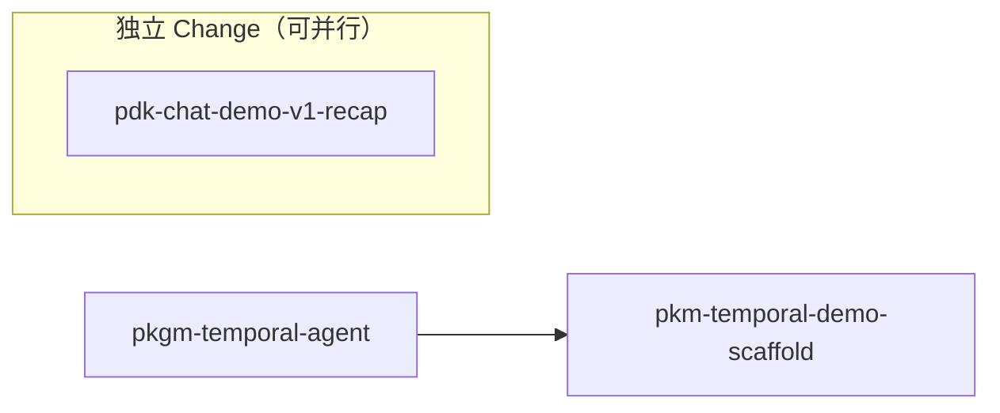

# 依赖分析报告

生成时间: 2026-07-27T04:27:10+08:00
候选 changes: 3

## 依赖图 (Mermaid)



## 阶段预检

基于每 change 的 `roadmap-meta.yaml`：

| Change | Phase | Category | 状态 |
|--------|-------|----------|------|
| pdk-chat-demo-v1-recap | ⚠️ 无 roadmap-meta | — | compat 模式 |
| pkgm-temporal-agent | ⚠️ 无 roadmap-meta | — | compat 模式 |
| pkm-temporal-demo-scaffold | ⚠️ 无 roadmap-meta | — | compat 模式 |

## Change 状态表

| Change | 状态 | 阻塞于 | 阻塞了谁 | 推荐 | 置信度 |
|--------|------|--------|---------|------|--------|
| pdk-chat-demo-v1-recap | ✅ ready | — | — | 第 1 优先（独立） | 高 |
| pkgm-temporal-agent | 🥇 prerequisite | — | pkm-temporal-demo-scaffold | 第 1 优先（前置） | 高 |
| pkm-temporal-demo-scaffold | ⚠️ blocked_by | pkgm-temporal-agent | — | 等 pkgm-temporal-agent 完成后 | 高 |

## 推荐执行顺序

```
1. pdk-chat-demo-v1-recap    ← 独立，可立即执行
2. pkgm-temporal-agent       ← 第 1 优先前置（demo 依赖它）
3. pkm-temporal-demo-scaffold ← 阻塞于 pkgm-temporal-agent，等完成后执行
```

> 注: 1 和 2 之间无依赖，可并行执行。

## 冲突警告

✅ 无文件冲突 — 三个 change 操作不同目录:
- `pdk-chat-demo-v1-recap`: `examples/pdk_chat_demo/`, `tests/`
- `pkgm-temporal-agent`: `pdks/pdk_temporal/`, `include/agenticdsl/pdk/temporal/`
- `pkm-temporal-demo-scaffold`: `examples/pkm_temporal_demo/`, `tests/`

## 🧠 AI 语义分析

### 接口依赖（轴 3）

| From | To | 关系 | 理由 | 置信度 |
|------|----|------|------|--------|
| pkm-temporal-demo-scaffold | pkgm-temporal-agent | 依赖 | demo 使用 temporal_agent PDK Plugin (proposal.md: "展示 temporal_agent PDK Plugin 实际集成") | 高 |

### 粒度评估

- **pdk-chat-demo-v1-recap**: ✅ 合理 — Scope 限定在 pdk_chat_demo 收尾, 18 个任务
- **pkgm-temporal-agent**: ✅ 合理 — 纯 C++ PDK Plugin, 39 个任务 (完整规范)
- **pkm-temporal-demo-scaffold**: ✅ 合理 — Demo 骨架项目, 17 个任务

### 建议

- `pdk-chat-demo-v1-recap` 与 `pkgm-temporal-agent` 无依赖，可并行 ship
- `pkm-temporal-demo-scaffold` 必须在 `pkgm-temporal-agent` ship 后才能执行
- 所有三个 change artifacts 已提交，可直接进入 ship 阶段

### 风险提示

| 风险 | 影响 | 缓解 |
|------|------|------|
| pkgm-temporal-agent 设计变更 | 可能影响 pkm-temporal-demo-scaffold 的接口使用 | demo 先按当前设计写，agent 变更后同步更新 |
| 无 ADR 显式引用 | deps 分析缺少 ADR 链证据 | 建议后续在 proposal.md 中补 ADR 引用 |
