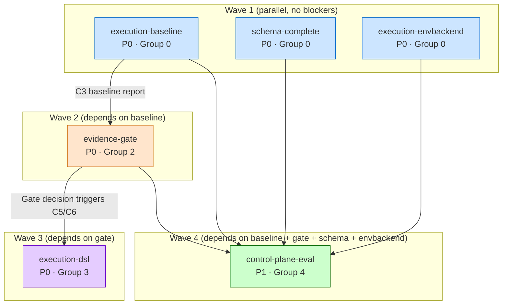

# Phase 6c Dependencies Analysis

**Generated**: 2026-08-17T17:15:30+00:00
**Iteration source**: `.rddf/state/iteration.json`
**Candidates source**: `.rddf/state/.deps-candidates.json`
**Active changes**: 6

## Summary

| Change | Priority | Group | Blocker | ADR Refs |
|--------|----------|-------|---------|----------|
| `from-roadmap-phase-6c-execution-baseline` | P0 | 0 | — | ADR-0074 |
| `from-roadmap-phase-6c-evidence-gate` | P0 | 2 | execution-baseline | ADR-0074 |
| `from-roadmap-phase-6c-execution-dsl` | P0 | 3 | evidence-gate | ADR-0072 |
| `from-roadmap-phase-6c-schema-complete` | P0 | 0 | — | ADR-0073/0069/0068 |
| `from-roadmap-phase-6c-execution-envbackend` | P0 | 0 | — | ADR-0075/0069/0055 |
| `from-roadmap-phase-6c-control-plane-eval` | P1 | 4 | all 4 P0 (except dsl) | ADR-0079 |

## Wave Execution Order (Recommended)

### Wave 1 — Group 0 (parallel, P0, no blockers)

可以并行 ship:

- **`from-roadmap-phase-6c-execution-baseline`** (P0): Few-shot examples (4 dims × 8 = 32) + 50-task golden suite + V1/V2/V3 prompt implementation + first baseline measurement report.
- **`from-roadmap-phase-6c-schema-complete`** (P0): ADR-0073 D3 ToolCoordinator 4-step sanitization pipeline (schema validate → coercion → required → business rules).
- **`from-roadmap-phase-6c-execution-envbackend`** (P0): IEnvBackend abstraction + LocalBackend (fork+execve) + DockerBackend (libcurl+REST API) + EnvValidationHook + BackendPolicy.

### Wave 2 — Group 2 (depends on Wave 1 execution-baseline)

- **`from-roadmap-phase-6c-evidence-gate`** (P0): Consumes baseline data from Wave 1, emits Evidence Gate decision (PASS / FAIL / CONDITIONAL / ABORT). Decision triggers C5/C6 in execution-dsl.

### Wave 3 — Group 3 (depends on Wave 2 evidence-gate)

- **`from-roadmap-phase-6c-execution-dsl`** (P0): Conditional ship per Evidence Gate decision:
  - `Pass` → descope (C5/C6 跳过)
  - `Conditional` (85% ≤ parse-valid < 90%) → ship C6+C7 only
  - `Fail` (parse-valid < 85%) → ship C5+C6+C7

### Wave 4 — Group 4 (depends on all Wave 1-3 except dsl)

- **`from-roadmap-phase-6c-control-plane-eval`** (P1): One-key script to evaluate 6 Phase 7 launch conditions; must wait for execution-baseline + evidence-gate + schema-complete + execution-envbackend to ship (collects their ship status as inputs).

## Dependency Graph (Mermaid)

## Conflict Detection

**File conflict scan**: No direct file conflicts detected (each change operates on distinct module paths in `openspec/changes/<name>/`).

**ADR reference overlap**:

- `ADR-0069 tool-coordinator-hooks` — referenced by `schema-complete` + `execution-envbackend` (C13 EnvValidationHook 接入 ToolCoordinator pre-hook)。**Both ship ToolCoordinator pre-hook 集成**,需要确保 hook 顺序不冲突 (per ADR-0069 §决策 D3).
- `ADR-0068 event-emission-contract` — referenced by `schema-complete` (tool.audit.denied events). No conflict with others.
- `ADR-0074 prompt-evidence-gate` — referenced by `execution-baseline` + `evidence-gate`. **Sequential dependency**, not conflict.

**Code path overlap**:

- `src/common/tools/tool_coordinator.cpp` — modified by `schema-complete` (4-step pipeline insertion) + indirectly referenced by `execution-envbackend` (EnvValidationHook pre-hook). **Sequential**: schema-complete adds pipeline → execution-envbackend adds pre-hook.
- `src/modules/parser/markdown_parser.{h,cpp}` — modified by `execution-dsl` only.
- `src/common/env/*` — new code by `execution-envbackend` only.

## ADR Impact Summary

| ADR | Changes Touching | State Flip Trigger |
|-----|------------------|--------------------|
| ADR-0072 DSL extensions | execution-dsl (D2/D3/D5) | Conditional on Evidence Gate |
| ADR-0073 Tool JSON Schema | schema-complete (D3) | 🟡 → ✅ on ship |
| ADR-0074 Prompt + Evidence Gate | execution-baseline (D1/D2/D3) + evidence-gate (D4) | 🔍 → 🟡 on Gate Pass |
| ADR-0075 EnvBackend | execution-envbackend (D1/D2/D3/D5) | 🔍 → ✅ on ship |
| ADR-0079 Control Plane Launch | control-plane-eval | 🔍 → 🟡 on ship |

## Recommended Sprint Plan

| Sprint | Wave | Capacity | Risk |
|--------|------|----------|------|
| Sprint 23 | Wave 1 (3 P0 parallel) | 3 × ~16h = ~48h | Medium (env-backend largest) |
| Sprint 24 | Wave 2 (1 P0) | ~4h | Low |
| Sprint 25 | Wave 3 (1 P0 conditional) | ~16h max | Medium (conditional scope) |
| Sprint 26 | Wave 4 (1 P1) | ~2h | Low |

**Total**: 4 Sprints, 5 P0 + 1 P1, max ~70h

## Restructure Suggestions

None — current grouping is optimal (3 parallel in Wave 1 minimizes sequential bottleneck).

## Notes

- Wave 3 (execution-dsl) is conditional — if Evidence Gate fails, scope may expand to 16h (full C5+C6+C7); if pass, descope to 0h.
- control-plane-eval (P1) is a dependency sink — its value is only realized after Wave 1+2+schema+envbackend ship. Recommended to defer to Sprint 26+ to avoid blocking critical path.
- Wave 1 P0 parallelism assumes 3+ Solo Dev capacity — if capacity = 1 (current), Wave 1 must serialize (env-backend 22h + schema 6h + baseline ~16h = ~44h sequential).
