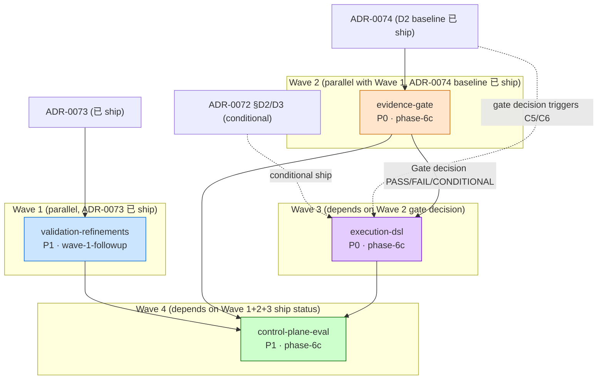

# Phase 6c Wave-2 Dependencies Analysis

**Generated**: 2026-08-19T16:40:00+00:00
**Iteration source**: `.rddf/state/iteration.json`
**Candidates source**: `.rddf/state/.deps-candidates.json` (4 candidates)
**Active changes**: 4 (Wave-2 follow-up to Wave-1 已 archived)

## Summary

| Change | Priority | Phase | Blocker | ADR Refs | Modified Files |
|--------|-----------|-------|---------|----------|----------------|
| `from-roadmap-phase-6c-validation-refinements` | P1 | wave-1-followup (debt) | ADR-0073 (已 ship) | ADR-0073 | `src/common/tools/tool_coordinator.{h,cpp}`, `include/agenticdsl/tools/tool_schema_validator.h`, `include/agenticdsl/pdk/tool_macros.h` |
| `from-roadmap-phase-6c-evidence-gate` | P0 | phase-6c | ADR-0074 (C3 baseline 已 ship) | ADR-0072, ADR-0074 | `src/common/prompts/evidence_gate.h` (new), `tests/test_evidence_gate.cpp` (new), `docs/audits/<date>-evidence-gate-v1.md` (new) |
| `from-roadmap-phase-6c-execution-dsl` | P0 | phase-6c | **evidence-gate (Evidence Gate decision)** | ADR-0072, ADR-0074 | `src/modules/parser/markdown_parser.{h,cpp}`, `src/modules/parser/declarative_style.{h,cpp}` (new), `src/modules/parser/dual_syntax_lint.cpp` (new), `tests/test_dsl_extensions.cpp` (new) |
| `from-roadmap-phase-6c-control-plane-eval` | P1 | phase-6c | **all 3 P0 above (collects their ship status)** | ADR-0068, ADR-0073, ADR-0075, ADR-0079 | `scripts/control-plane-eval.py` (new), `docs/audits/<date>-control-plane-eval-v1.md` (new) |

## Wave Execution Order (Recommended)

### Wave 1 — Group 0 (parallel, no blockers, ADR-0073 已 ship)

可并行 ship (无 file conflict,无 ADR blocker):

- **`from-roadmap-phase-6c-validation-refinements`** (P1): ToolCoordinator 4 步 sanitization pipeline 的 3 个 P1 语义缺口修复 (P1#1 Warn-mode coercion 透明化, P1#2 不可转换输入 warn, P1#3 enum post-coercion retry) + emit_audit_denied 继承 ctx.session_id/trace_id + DECLARE_TOOL_V3 默认值 Strict → Warn。

### Wave 2 — Group 2 (depends on ADR-0074 C3 baseline 已 ship)

可与 Wave 1 并行 (无 file conflict):

- **`from-roadmap-phase-6c-evidence-gate`** (P0): 创建 `evaluate_gate()` 决策树函数 + `docs/audits/<date>-evidence-gate-v1.md` 决议文档模板 + 消费 C3 baseline 报告输出 PASS/FAIL/CONDITIONAL/ABORT 决议。

### Wave 3 — Group 3 (depends on Wave 2 evidence-gate)

**Strict 阻塞**:

- **`from-roadmap-phase-6c-execution-dsl`** (P0): C5 (D2 `$var`) + C6 (D3 `exec:`) + C7 (D5 lint) conditional ship per Evidence Gate 决议:
  - `Pass` (parse-valid ≥90%) → descope C5/C6,本提案 active 任务清零
  - `Conditional` (85% ≤ parse-valid < 90%) → ship C6+C7 (8h)
  - `Fail` (parse-valid <85%) → ship C5+C6+C7 (16h)
  - 阻塞原因:ADR-0072 §决策 D2/D3 + ADR-0074 §决策 D4 强制 gated by Evidence Gate 决议

### Wave 4 — Group 4 (depends on Wave 2 + Wave 3 + validation-refinements)

**Strict 阻塞**:

- **`from-roadmap-phase-6c-control-plane-eval`** (P1): 6 项 Phase 7 启动条件评估脚本,需收集 evidence-gate + execution-dsl + validation-refinements 的 ship 状态作为输入。

## Dependency Graph (Mermaid)

## Change Status Table

| Change | Status | Blocked By | Blocks | Conflict | Confidence | Recommendation |
|--------|--------|-----------|--------|----------|------------|----------------|
| `validation-refinements` | ✅ ready | ADR-0073 (已 ship) | `control-plane-eval` | — | 高 | Wave 1 第 1 批并行 ship |
| `evidence-gate` | ✅ ready | ADR-0074 baseline (已 ship) | `execution-dsl`, `control-plane-eval` | — | 高 | Wave 1 第 2 批并行 ship |
| `execution-dsl` | ⚠️ blocked_by | `evidence-gate` (Gate decision) | `control-plane-eval` | — | 高 | Wave 3,等 evidence-gate 决议 |
| `control-plane-eval` | ⚠️ blocked_by | all 3 above (ship status) | — | — | 高 | Wave 4 最后 ship |

## Conflict Detection

**File conflict scan**: No direct file conflicts detected among the 4 active changes. Each operates on distinct module paths:

| Change | Module Path | New vs Modified |
|--------|-------------|-----------------|
| `validation-refinements` | `src/common/tools/`, `include/agenticdsl/tools/`, `include/agenticdsl/pdk/` | Modified (4 files) + New (1 test) |
| `evidence-gate` | `src/common/prompts/`, `tests/`, `docs/audits/` | New (3 files) |
| `execution-dsl` | `src/modules/parser/`, `tests/`, `docs/specs/` | New (3 files) + Modified (1 doc) |
| `control-plane-eval` | `scripts/`, `docs/audits/` | New (2 files) |

**ADR reference overlap**:

| ADR | Referenced By | State | Notes |
|-----|---------------|-------|-------|
| `ADR-0072 DSL extensions` | `evidence-gate` + `execution-dsl` | 🔍 Proposed | evidence-gate 不修改 ADR-0072,execution-dsl 实施 D2/D3/D5 → 顺序无冲突 |
| `ADR-0073 Tool Schema` | `validation-refinements` + `control-plane-eval` | 🟡 Partial → ✅ Approved (post-ship) | validation-refinements 是 D3 follow-up fix,control-plane-eval 引用 ADR-0073 ship 状态作为条件 4 |
| `ADR-0074 Prompt Evidence Gate` | `evidence-gate` + `execution-dsl` | 🔍 Proposed → 🟡 Partial (post evidence-gate ship) | execution-dsl gated by Evidence Gate decision (核心条件链) |
| `ADR-0068/0075/0079` | `control-plane-eval` only | ✅ Approved | 无重叠 |

**Code path overlap**: No direct code path overlap detected.

## ADR Impact Summary

| ADR | Changes Touching | State Flip Trigger |
|-----|------------------|--------------------|
| `ADR-0072 DSL extensions` | `execution-dsl` (D2/D3/D5 conditional) | ship only if Evidence Gate Conditional or Fail |
| `ADR-0073 Tool Schema Contract` | `validation-refinements` (3 P1 fixes) + `control-plane-eval` (条件 4 reads status) | 🟡 Partial → ✅ Approved post validation-refinements ship |
| `ADR-0074 Prompt Evidence Gate` | `evidence-gate` (C4 implement) + `execution-dsl` (C5/C6 gated) | 🔍 Proposed → 🟡 Partial post evidence-gate ship |
| `ADR-0079 Control Plane Eval` | `control-plane-eval` | C4 implements C4 step |
| `ADR-0075 EnvBackend` | `control-plane-eval` (条件 6 reads ship status) | ✅ Approved (already) |
| `ADR-0068 Event Emission` | `control-plane-eval` (条件 3 reads status) | ✅ Approved (already) |

## 🧠 AI 分析建议

⚠️ **AI 语义分析未启用 (fallback)** - 子代理不可用或调用失败, 详见 deps.md Step 3f
以下内容为基于静态三轴分析（文件冲突、ADR 引用、接口依赖）的结论。
AI 子代理语义分析功能（语义依赖、粒度评估、重组建议）待子代理可用时启用。

### 静态分析结论

1. **Wave 1 (并行, 无 file conflict)**:
   - `validation-refinements` 改 `src/common/tools/` (4 files) + `include/agenticdsl/pdk/tool_macros.h`
   - `evidence-gate` 新建 `src/common/prompts/` + `tests/test_evidence_gate.cpp`
   - **完全独立模块**,可并行 ship

2. **Wave 3 强阻塞**:
   - `execution-dsl` **必须** 等 `evidence-gate` 输出 Gate decision 后才能决定 ship 哪些 (C5/C6/C7 conditional)
   - 阻塞粒度:soft block (Gate decision 是 conditional,不是 binary)
   - **关键路径**:Evidence Gate PASS → execution-dsl 可以 descope;FAIL/CONDITIONAL → execution-dsl 必须 ship

3. **Wave 4 集成阻塞**:
   - `control-plane-eval` 依赖 6 项条件中 ≥3 项 status (ADR-0074 + ADR-0073 + ADR-0075 + ADR-0068)
   - 这些 status 在 validation-refinements / evidence-gate / execution-dsl ship 后才完整
   - 阻塞粒度:hard block (无 ship 状态 = 无完整评估)

4. **粒度合理性**: 4 个 changes 全部 ✅ 合理 scope,无过大/过小需要拆分。

5. **重组建议**: 无 (changes 间无重复实现,无遗漏依赖)

## 阶段预检

| Change | Phase | Category | 状态 |
|--------|-------|----------|------|
| `validation-refinements` | wave-1-followup | debt | ⚠️ follow-up wave,但与 phase-6c ship 兼容 (不冲突) |
| `evidence-gate` | phase-6c | core-deliverable | ✅ 在阶段内 |
| `execution-dsl` | phase-6c | core-deliverable (conditional) | ✅ 在阶段内 |
| `control-plane-eval` | phase-6c | evaluator-tool | ✅ 在阶段内 |