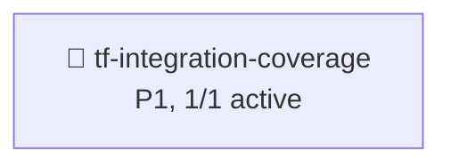

# Deps Analysis Output

**Generated**: 2026-08-01
**Project**: HydraForge
**Tool**: Manual (single active change, deps subagent not required)

## Candidate Changes

| Change | Schema | Capabilities Added | Capabilities Modified |
|---|---|---|---|
| tf-integration-coverage | spec-driven | taskflow-integration-test-coverage | dag-scheduler-pipeline |

## Mermaid Dependency Graph

**Graph interpretation**:
- 1 active change
- 0 internal dependencies (no inter-change blockers)
- 0 file conflicts
- 0 cross-ADR violations

## Conflict Detection

✅ **No file conflicts** — only 1 active change, no shared files

✅ **No capability conflicts** — new capability `taskflow-integration-test-coverage` is unique, modified capability `dag-scheduler-pipeline` has no other concurrent delta

✅ **No ADR violations** — change does not violate any existing ADR (ADR-0030 V2 explicitly supports std::jthread + Taskflow; this change only adds Config field + tests)

## Capability Delta Summary

### `taskflow-integration-test-coverage` (NEW)
9 ADDED requirements covering:
1. 依赖边派发契约 (5-node linear chain A→B→C→D→E)
2. 跨调用复用契约 (parallel_executor_ pointer stability)
3. 错误传播契约 (runtime_error swallowed, success=false)
4. 混合节点类型契约 (3 ToolCall + 1 LLM + 1 Fork + 1 Join)
5. Worker 数注入契约 (num_workers field)
6. 大 DAG 规模契约 (100 nodes flat + 8 workers)
7. Fork/Join 并行契约 (1 fork + 4 branches + 1 join)
8. 边界条件契约 (0/1 node edge cases)
9. 析构安全契约 (~tf::Executor() join behavior)

### `dag-scheduler-pipeline` (MODIFIED)
1 ADDED requirement: `Config::num_workers` field with default 0 → hardware_concurrency fallback

## Recommended Execution Order

1. **`tf-integration-coverage`** (P1, 2-3 weeks, no blockers)
   - Plan: `.rddf/plans/tf-integration-coverage.md` (TDD 5-step)
   - Worktree: feature/tf-integration-coverage
   - Ship gate: ctest 64/64 + TSan 0 + ASan 0 + openspec validate

## Wave Schedule

| Wave | Changes | Reasoning |
|---|---|---|
| Wave 1 | tf-integration-coverage | Single change, no inter-dependencies |

## Plan-Done Prerequisites

- [x] ≥1 active change (1/1)
- [x] All 4 artifacts committed (proposal/design/specs/tasks)
- [x] openspec validate passed
- [x] git commit landed
- [x] proposal-suggestions.md status updated
- [x] No blockers
