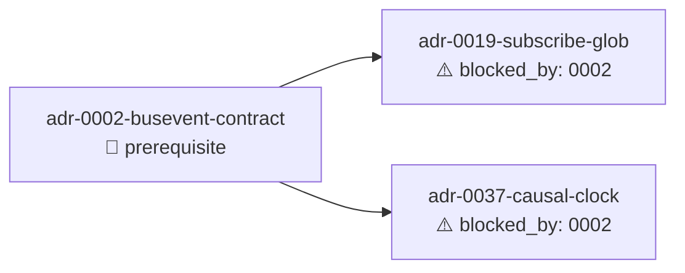

# 依赖分析输出 — HydraForge plan 阶段

**生成时间**: 2026-07-29
**候选 change 数量**: 3
**AI 语义分析**: ⚠️ **AI 语义分析未启用 (fallback)** — 仅依赖静态三轴分析

## 候选 change 列表

| Change | 优先级 | 状态 | 依赖 |
|---|---|---|---|
| adr-0002-busevent-contract | P1 | ready（前置） | — |
| adr-0019-subscribe-glob | P1 | blocked_by 0002 | change:adr-0002-busevent-contract |
| adr-0037-causal-clock | P2 | blocked_by 0002 | change:adr-0002-busevent-contract |

## 依赖图（Mermaid）

## 推荐执行顺序

1. `adr-0002-busevent-contract`（前置，bus_event contract 收敛 → BusEvent/topic/causal_time 字段全部就位）
2. `adr-0019-subscribe-glob` + `adr-0037-causal-clock`（可并行，依赖仅 0002）

## 静态三轴分析

### 轴 1：文件冲突

| 候选 | 涉及文件 |
|---|---|
| adr-0002-busevent-contract | `include/agenticdsl/contract/bus_event.h`, `include/agenticdsl/contract/iinteraction_bus.h`, `include/agenticdsl/contract/inmemory_bus.h`, `src/common/contract/inmemory_bus.cpp`, 3 test mocks |
| adr-0019-subscribe-glob | `include/agenticdsl/contract/iinteraction_bus.h` (subscribe 参数), `include/agenticdsl/contract/inmemory_bus.h` (exact_subscribers_ + wildcard_subscribers_), `tests/test_interaction_bus_glob.cpp` |
| adr-0037-causal-clock | `include/agenticdsl/contract/causal_clock.h`, `src/common/contract/causal_clock.h`, `src/common/contract/inmemory_bus.cpp` (emit auto-tick), `tests/test_causal_clock.cpp` |

**冲突分析**:
- 0002 ↔ 0019: `iinteraction_bus.h`、`inmemory_bus.h` 共享 — 顺序执行（0002 先）
- 0002 ↔ 0037: `inmemory_bus.cpp` 共享 — 顺序执行（0002 先）
- 0019 ↔ 0037: 无文件交集 — 可并行

### 轴 2：ADR 引用

| Change | ADR 引用 |
|---|---|
| adr-0002-busevent-contract | ADR-0002, ADR-0019, ADR-0037 |
| adr-0019-subscribe-glob | ADR-0019, change:adr-0002-busevent-contract |
| adr-0037-causal-clock | ADR-0037, change:adr-0002-busevent-contract |

### 轴 3：接口依赖

| 接口 | 定义于 | 使用于 |
|---|---|---|
| BusEvent struct | adr-0002 | adr-0019 (topic), adr-0037 (causal_time) |
| IInteractionBus::emit(BusEvent) | adr-0002 | adr-0019, adr-0037 |
| IInteractionBus::subscribe(pattern) | adr-0019 | — |
| CausalClock::tick() | adr-0037 | InMemoryBus::emit (adr-0002/0037) |

## 粒度评估

- ✅ adr-0002: 合理（独立的契约收敛 + 4 实现者迁移）
- ✅ adr-0019: 合理（接口扩展 + 双路径分发 + race test）
- ✅ adr-0037: 合理（CausalClock + emit auto-tick + soak test）

## 重组建议

无需拆分/合并。3 个 change 边界清晰。

## 冲突警告

🔴 顺序执行依赖（非冲突，已通过依赖图反映）:
- 0002 必须先于 0019 / 0037
- 0019 与 0037 可并行

## 🧠 AI 分析建议

⚠️ **AI 语义分析未启用 (fallback)** — 以下为静态三轴 + 已知项目上下文推断：

- 序列正确：0002 在前，{0019, 0037} 在后并行
- 跨层耦合：0019 + 0037 都消费 BusEvent 字段，必须等待 0002 完成 emit signature 收敛
- 已知风险：adr-0037 §决策 1 单进程逻辑时钟可能在 OWNER 多线程场景下丢失 monotonicity（task 3 soak test 验证）
- 已知约束：adr-0019 glob 匹配算法复杂度 O(w) — task 4 race test 验证 concurrent subscribe/unsubscribe 安全
