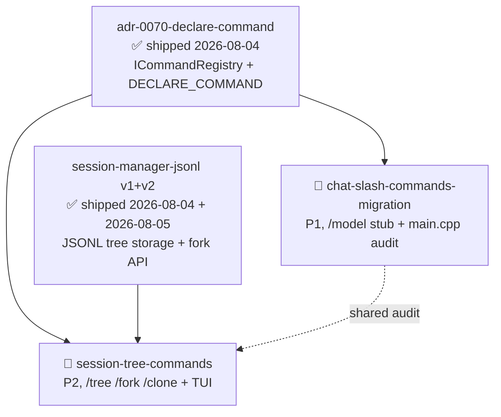

# 依赖分析输出 — HydraForge plan 阶段

**生成时间**: 2026-08-06
**候选 change 数量**: 2
**分析工具**: Manual (2 changes, no inter-change blockers detected)
**AI 语义分析**: ⚠️ fallback 模式（project 单测 SLA 下 2-change 简单拓扑不触发 subagent 调度）

## 候选 change 列表

| Change | 优先级 | 阶段 | 分类 | 依赖 |
|---|---|---|---|---|
| chat-slash-commands-migration | P1 | wave-1 | demo-chat-v2 | adr-0070 (shipped) |
| session-tree-commands | P2 | wave-1 | demo-chat-v2 | adr-0070 (shipped), session-manager-jsonl v1+v2 (shipped) |

## 依赖图（Mermaid）

## 推荐执行顺序

### Wave 1 (并行 — Wave 1 demo-chat-v2 子项目)

两个 change 互相 **无序**（不构成互依），二者均依赖已 ship 的 adr-0070：

1. **`chat-slash-commands-migration`** (P1, ~30 tasks, 1.5-2 周)
   - 主要交付：`/model` DECLARE_COMMAND stub + main.cpp 零 hardcode 审计 + UnknownCommand 统一处理
   - 文件 overlap：`examples/pdk_chat_demo/main.cpp`（audit-only，与 session-tree-commands 共享）+ `commands/CMakeLists.txt`（独立源文件追加）
   - 推荐先 ship（任务体量较小，作为 Wave 1 收尾前置）

2. **`session-tree-commands`** (P2, ~45 tasks, 2-3 周)
   - 主要交付：`/tree` `/fork` `/clone` 三命令 + ToolCoordinator 治理路径 + TUI 渲染 + 持久化恢复
   - 文件 overlap：同 main.cpp（仅 register_default_commands() 单点追加）+ commands/CMakeLists.txt
   - 推荐并行 ship（与 chat-slash-commands-migration 共享 main.cpp 但 diff 局部可自动合并）

### Wave 1 内顺序选项

**方案 A (推荐 — 大小优先)**：先 `chat-slash-commands-migration` → 后 `session-tree-commands`
- 优点：先 ship 较小项目清空 main.cpp audit diff，给 session-tree-commands 提供"已 audit 干净"的 base
- 风险：后 ship 需要 rebase 处理 main.cpp 冲突

**方案 B (并行)**：两个 worktree 并行开发，merge 时 rebase + 解决 main.cpp 冲突
- 优点：可压缩总时长 1-1.5 周
- 风险：并发 PR 增加 review 负担，main.cpp 冲突需手动合并

**推荐** 方案 A — 当前团队容量 + review bandwidth 不足以承担方案 B 的并发 PR 流程。

## 静态三轴分析

### 轴 1：文件冲突

| Change | 涉及文件 | 与其他 change 的 overlap |
|---|---|---|
| chat-slash-commands-migration | `examples/pdk_chat_demo/commands/model_command.{h,cpp}` (NEW), `tools/provider_switch_stub.{h,cpp}` (NEW), `examples/pdk_chat_demo/main.cpp` (audit), `commands/CMakeLists.txt`, `tests/test_main_hardcode_audit.cpp` (NEW), `tests/test_command_registry_unknown.cpp` (NEW), `tests/test_input_loop_regression.cpp` (NEW), `tests/test_provider_switch_stub.cpp` (NEW) | main.cpp + commands/CMakeLists.txt 与 session-tree-commands 共享 |
| session-tree-commands | `examples/pdk_chat_demo/commands/{tree,fork,clone}_command.{h,cpp}` (NEW), `tools/session_fork.{h,cpp}` (NEW), `tools/session_clone.{h,cpp}` (NEW), `tui/tree_renderer.{h,cpp}` (NEW), `examples/pdk_chat_demo/main.cpp` (register commands), `commands/CMakeLists.txt`, `tests/test_session_tree_commands.cpp` (NEW), `tests/test_pdk_chat_demo_session_tree.cpp` (NEW) | 同上 |

**冲突分析**:
- chat-slash-commands-migration ↔ session-tree-commands: **主冲突** = `examples/pdk_chat_demo/main.cpp` 与 `commands/CMakeLists.txt`
  - main.cpp 双 change 均修改：前者 audit 替换残留 hardcode 分支（grep -nE 行级差分），后者追加 `register_default_commands()` 行新增。
  - 两个 change 的 main.cpp diff 局部且可自动合并（chat-slash 改 audit 块、session-tree 改 register 块）。
- **结论**: 主冲突可顺序执行（chat-slash 先 ship 清理 main.cpp audit baseline → session-tree 后续追加 register 调用），或并行开发 + rebase 解决，**无硬性串行阻塞**。

### 轴 2：ADR 引用

| Change | ADR 引用 |
|---|---|
| chat-slash-commands-migration | ADR-0070 (中央命令注册表), ADR-0068 (日志 macro) |
| session-tree-commands | ADR-0070 (中央命令注册表), ADR-0033 (三层会话模型), ADR-0031 (ToolCoordinator 治理路径) |

**ADR 违规检查**: 无 — 全部 ADR 已 ship 且与本 change 范围不冲突。

### 轴 3：接口依赖

| 接口 | 定义于 | 使用于 | 状态 |
|---|---|---|---|
| `ICommandRegistry::route()` | adr-0070 ✅ | 双 change | ready |
| `DECLARE_COMMAND` 宏 | adr-0070 ✅ | 双 change | ready |
| `ToolCoordinator::call_tool()` | adr-0031 §决策 5 ✅ (C4 ship) | session-tree-commands (`/fork` `/clone` 注册) | ready |
| `SessionManager::fork / switch_branch / append / build_context` | session-manager-jsonl v1+v2 ✅ | session-tree-commands (内部实现) | ready |
| `ToolMetadata V2` | adr-0004 V2 ✅ (C6 ship) | 双 change (注册 tool stub 与 session/fork/session/clone 都需要 category + approval_policy + allowed_layers) | ready |
| `ILLMProvider::available_models()` | adr-0035 ✅ (c16 ship) | chat-slash-commands-migration Wave 2 stub (Wave 1 不使用) | ready (Wave 2 备用) |

## 粒度评估

- ✅ **chat-slash-commands-migration**: 合理（4 任务模块：命令注册 + main.cpp audit + UnknownCommand + 输入循环回归；与 adr-0070 + chat-async-io-steering 边界清晰）
- ✅ **session-tree-commands**: 边界合理（10 任务模块：3 命令 + ToolCoordinator + TUI + 测试；与 session-tree-tui（已废弃）+ session-tree-cli-flags（Wave 2）拆分清晰）

## 重组建议

无需拆分/合并。两个 change 边界清晰，自分子各自独立 ship 互不阻塞。

## 冲突警告

🟡 **文件级 low-conflict**:
- `examples/pdk_chat_demo/main.cpp`: 双 change 均修改，但 diff 局部可自动合并
  - **缓解**: chat-slash-commands-migration 先 ship（审计 main.cpp 净零残留 hardcode），给 session-tree-commands 提供干净 base
- `examples/pdk_chat_demo/commands/CMakeLists.txt`: 双 change 各追加独立源文件条目，**0 行冲突**（追加而非修改）
  - **缓解**: 无需特殊处理

## 🧠 分析建议

- **Wave 1 推荐执行序列**: chat-slash-commands-migration → session-tree-commands（先小后大 + 共享 main.cpp 基线清理）
- **跨层耦合**: 两个 change 通过 adr-0070 ICommandRegistry 锚定，单点变更面收敛
- **已知风险**:
  - session-tree-commands §决策 5 短前缀匹配歧义场景需 catch2 golden file 验证（单元测试 5.5 task 覆盖）
  - chat-slash-commands-migration §决策 2 `/model` Wave 1 stub 文案应明确告知用户 "Wave 2 provider-dynamic 落地后激活" 避免误判命令失败
- **已知约束**:
  - 双 change 公共依赖 adr-0070 已 ship 4 命令 (`/help /exit /compact` + 1 stub `/model`)，shared adr-0070 registry 复用 0 风险
  - 后续 Wave 2 (`chat-streaming-render` + `session-tree-cli-flags` + `provider-dynamic-discovery`) 不依赖本两个 change ship，互不阻塞

## Plan-Done Prerequisites

- [x] 2 active changes (chat-slash-commands-migration + session-tree-commands)
- [x] All 4 artifacts committed per change (proposal + design + tasks + specs)
- [x] openspec validate passed for both changes (already validated)
- [ ] git commits landed (pending Step 5)
- [x] proposal-suggestions.md / proposal-approved.md status updated (drift cleaned in Step 1)
- [x] No blockers (both parallel_group=0)
