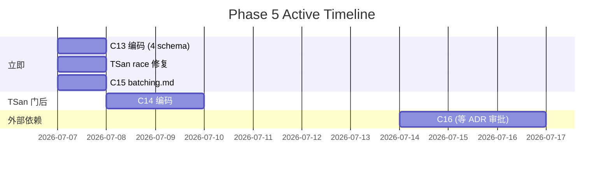

# Active Status Board

> **焦点**: 当前活跃的 OpenSpec changes | **更新**: 每日
> **Master Plan**: [`docs/superpowers/plans/2026-07-03-phase5-self-bootstrapping.md`](superpowers/plans/2026-07-03-phase5-self-bootstrapping.md)
> **架构决策**: [`docs/adversarial-reviews/decisions-2026-07-07.md`](adversarial-reviews/decisions-2026-07-07.md)
> **Phase**: 5 — 自举服务化 (2026-07-03 ~ 2026-10-31)

---

## 一、快速概览

| 维度 | 状态 |
|------|------|
| **Total ctest** | **64/64 ✅** PASS (baseline 25 + Sprint 1~20 累计 39 新增) |
| **ASan** | 64/64 (100%) |
| **TSan** | 61/64 (95%) — pre-existing `test_execute_parallel` data race (Taskflow/Catch2) |
| **OpenSpec active** | **2** (C14 🔒 + C16 🔒; C13/C15 已 ✅ shipped 2026-07-07) |
| **Completed Phase 0-4** | ✅ 100% |
| **Phase 5** | 🟡 实施中 (C10/C11/C12/C13/C15 shipped → C14 编码待 TSan gate + D5 决策 / C16 提案 v2 ready 等 ADR 审批) |

---

## 二、活跃变更一览

| ID | 名称 | 阶段 | 状态 | 阻塞于 | 最后更新 |
|----|------|------|:----:|--------|:--------:|
| **C13** | B2 架构层 Schema (`phase5-b2-arch-schemas`) | ✅ Done | **✅ shipped 2026-07-07** | — | 2026-07-07 |
| **C14** | Llama Engine Plugin (`phase5-llama-engine-plugin`) | 📋 Proposal ✅ | **🔒 阻塞** | TSan gate + D5 默认注入决策 | 2026-07-07 |
| **C15** | Batching Queue Plugin (`phase5-batching-queue-plugin`) | ✅ Done | **✅ shipped 2026-07-07 (D2 精简版)** | — | 2026-07-07 |
| **C16** | ILLMProvider Call Chain V2 (`phase5-illmprovider-call-chain-v2`) | 🔍 分析 | **🔒 阻塞** | ADR-0035/42/45 审批 + v2 提案 ready | 2026-07-07 |

### 状态图例

| 标记 | 含义 |
|:----:|------|
| 📋 Proposal | proposal.md 已完成 |
| 📐 Tasks | tasks.md 已完成 |
| 📝 Spec | spec.md 已完成 |
| 🔨 编码 | 正在写代码 |
| ✅ Done | 全部 ship gate 通过 |
| 🔒 阻塞 | 等待外部条件 |
| ➡️ 顺延 | 无启动触发条件 |

---

## 三、各变更详情

### C13 / `phase5-b2-arch-schemas`

| 属性 | 内容 |
|------|------|
| **目标** | 创建 4 个架构层 `.md` schema: `prefix_cache.md`, `kv_cache.md`, `decoding.md`, `cloud_engine.md` |
| **D1 已应用** | SamplerStrategy PDK 接口 **删除** — decoding.md 的 sampler 字段保持字符串选择 (5 种) |
| **D3 已应用** | 命名风格统一 `inference.*` |
| **Proposal** | ✅ 干净 (SamplerStrategy 引用全部删除) |
| **Tasks** | ✅ 干净 (§3.2 删除) |
| **Spec** | ✅ 干净 |
| **ship 状态** | ✅ **shipped 2026-07-07** — 4 个 `.md` schema 文件落地 + handoff §10.2 + master plan §C13 已标记 |
| **ship 内容** | `lib/inference/prefix_cache.md` + `kv_cache.md` + `decoding.md` + `cloud_engine.md` (PLACEHOLDER) |
| **验证** | `adr_lint` exit 0 + `openspec validate` exit 0 + `docs_drift_audit` 0 DRIFT + `grep sampler_strategy` 0 matches |

### C14 / `phase5-llama-engine-plugin`

| 属性 | 内容 |
|------|------|
| **目标** | 在 `pdk/llama_engine/` 创建 engine/model 工具实现 (`inference/engine/*`, `inference/model/*`) |
| **D1 已应用** | SamplerStrategy 相关任务删除 (采样器 clamp 内联到 generate) |
| **D3 已应用** | 8 处工具名 `llama_engine/*` → `inference/engine/*`, `llama_model/*` → `inference/model/*` |
| **Proposal** | ✅ 已更新 |
| **Tasks** | ✅ 已更新 (§4 删除, 8 处工具名替换) |
| **Spec** | ✅ 已更新 |
| **剩余工作** | C14 编码: `pdk/llama_engine/` 目录 + 8 个工具注册 + 7 测试 |
| **估时** | ~2-3 天 |
| **启动条件** | **🔒 TSan gate 100%** (`test_execute_parallel` data race 修复验证) |
| **说明** | 编码与工具名重写已分离: 重写 30min 已完成, 编码等 TSan |

### C15 / `phase5-batching-queue-plugin`

| 属性 | 内容 |
|------|------|
| **目标** | 创建 `lib/inference/batching.md` PLACEHOLDER schema (40 行) |
| **D2 已应用** | BatchingQueue PDK 接口 + LlamaBatchingQueue + 贡献流程全部 **推迟** |
| **Proposal** | ✅ 精简完成 (367→98 行) |
| **Tasks** | ✅ 精简完成 (161→70 行) |
| **Spec** | ✅ 精简完成 (214→26 行) |
| **ship 状态** | ✅ **shipped 2026-07-07 (D2 精简版)** — `lib/inference/batching.md` PLACEHOLDER 已落地 |
| **ship 内容** | `lib/inference/batching.md` (~40 行 PLACEHOLDER,batching.submit_and_wait 工具签名) + handoff §10.2 + master plan §C15 已标记 |
| **D2 验证** | 未创建 `include/agenticdsl/pdk/batching_queue.h` + 未创建 `LlamaBatchingQueue` + 未写贡献流程 |

### C16 / `phase5-illmprovider-call-chain-v2`

| 属性 | 内容 |
|------|------|
| **目标** | ILLMProvider 调用链 v2 架构（D2' Dual Consumer Model + D3 ILLMProviderDecorator + D1 Cloud plugin 化 + D5 available_models pure virtual） |
| **依赖** | ADR-0035 (inference engine plugin spec) ✅ → 🔍 Proposed |
| **依赖** | ADR-0042 (ILLMProvider evolution path) ✅ → 🔍 Proposed |
| **依赖** | ADR-0045 (orchestration plugin spec) ✅ → 🔍 Proposed |
| **Proposal** | 未修改 (等待 ADR 审批) |
| **D4 已应用** | ADR 审批通过前不做代码变更 |
| **启动条件** | **🔒 ADR-0035/0042/0045 全部 → ✅ Approved** |
| **ADR-0001 风险** | 本 change 修订 ADR-0001 显式记录 BREAKING change |

---

## 四、阻塞项

| 阻塞项 | 影响 | 预计解决时间 | 处理方式 |
|--------|------|:-----------:|---------|
| 🔴 `test_execute_parallel` TSan data race | 阻塞 C14 编码 | 0.5-1 天 | 修复 race (Sprint 10 pre-existing) |
| 🔴 ADR-0035 审批 | 阻塞 C16 编码 | 待定 | 完成审批流程 |
| 🔴 ADR-0042 审批 | 阻塞 C16 编码 | 待定 | 完成审批流程 |
| 🔴 ADR-0045 审批 | 阻塞 C16 编码 | 待定 | 完成审批流程 |

---

## 五、最近完成的变更

| 日期 | ID | 名称 | 关键 Ship |
|:----:|:--:|------|-----------|
| 2026-07-07 | — | c16-patches | C16 三处文档不一致 patch (active-status/proposal/specs) + D5 决策草稿 + proposal-v2.md (313 行, 5 项歧义消除) |
| 2026-07-07 | C15 | batching-queue-plugin | `lib/inference/batching.md` PLACEHOLDER (~40 行) + D2 精简 ship + handoff/master plan 同步 + openspec validate exit 0 |
| 2026-07-07 | C13 | b2-arch-schemas | 4 个 `lib/inference/{prefix_cache,kv_cache,decoding,cloud_engine}.md` schema 文件 + D1 SamplerStrategy 删除 + D3 命名统一 + handoff/master plan 同步 + 全部验证 exit 0 |
| 2026-07-06 | — | docs-cleanup-phase-2 | 5 个已 ship plan 归档, 22 个 openspec spec 补全, ADR 状态同步 |
| 2026-07-04 | C12 | yield-stream | 64/64 ctest, 9 个测试, YIELD 3 节点模式 + Budget 每 token 检查 |
| 2026-07-04 | C11 | session-registry | 63/63 ctest, SessionRegistry 5 方法, 4 个 session.* 工具 |
| 2026-07-03 | C10 | lazy-modulestate | module_states_ map lazy init |
| 2026-07-03 | C9 | adr-impl-scope-audit | 11 个 ADR 实施审计文档 |
| 2026-07-02 | C6 | tool-metadata-v2 | IToolRegistry + ToolMetadata V2 BREAKING |
| 2026-07-02 | C7 | model-router-plugin | 3 路由策略 .so, 4 个 registry 工具, 61/61 ctest |
| 2026-07-01 | — | http-mock-server-helper | HttpMockServer RAII helper, 消除 4 处模板重复 |
| 2026-06-30 | — | decompose-execution-session-h | execution_session.h 14→11 includes, 7→0 modules/ |
| 2026-06-30 | — | fix-audit-quick-debt-2026-06 | ToolResult::error BREAKING, PIMPL-lite MarkdownParser |
| 2026-06-25 | — | engine-include-final-decoupling | engine.cpp cross-module 10→3 |

---

## 六、下一步行动 (按 D4 优先级)

1. **TSan 修复**: 修复 `test_execute_parallel` data race (Sprint 10 pre-existing,C14 启动前置)
2. **D5 决策签字** (C14 启动前置): 在 `decisions-2026-07-07.md` 追加 D5 解决 `DSLEngine` 默认注入策略 (选项 A vs B)
3. **C14 编码** (TSan 门后 + D5 决策后): `pdk/llama_engine/` plugin 骨架 + 8 工具 (`inference/engine/*` × 4 + `inference/model/*` × 4) + 7 测试 + `engine.md`/`model.md` 升级
4. **ADR-0035/0042/0045 审批** (C16 启动前置): 3 个 ADR 状态从 🔍 Proposed → ✅ Approved
5. **D5 草稿应用** (可选): `/tmp/opencode/c16-patches/decisions-d5-draft.md` 直接追加到 `decisions-2026-07-07.md`
6. **C16 v2 评审 + 替换** (可选): `proposal-v2.md` 评审后替换 `proposal.md`,3 处 patch (`/tmp/opencode/c16-patches/`) apply 到 `active-status.md` + `proposal.md` + `specs/`
7. **C16 编码** (ADR 审批后): ILLMProvider v2 架构 (Dual Consumer Model + Decorator + Cloud plugin + `available_models()` pure virtual)

---

## 七、存档说明

> 以下历史看板已归档: 它们的 Phase 0-4 追踪已由 `docs/active-status.md` 替代。
>
> - **`docs/roadmap-status.md`** → `docs/archive/roadmap-status.md` (Phase 0-4 Sprint 日志, 最后更新 2026-06, 463 行)
> - **`docs/implementation-roadmap.md`** → `docs/archive/implementation-roadmap.md` (2016-06-03 旧蓝图, 829 行)

---

## 八、参考

| 文档 | 用途 |
|------|------|
| `docs/superpowers/plans/2026-07-03-phase5-self-bootstrapping.md` | 详细执行计划、依赖图、每 Change 精确实施步骤 |
| `docs/adversarial-reviews/decisions-2026-07-07.md` | B2 架构决策 D1-D4 正式记录 |
| `docs/adversarial-reviews/main-report.md` | Adversarial Review 完整报告 (5 大发现 + 4 方案对比) |
| `openspec/changes/` | 活跃 OpenSpec change 目录 (proposal/tasks/spec) |
| `docs/archive/roadmap-status.md` | Phase 0-4 历史 Sprint 追踪 (已归档) |
| `docs/archive/implementation-roadmap.md` | 旧实施路线图 (已归档) |
