# ADR 关联性分析（自动生成）

> 本文件由 `tools/adr_relationships.py` 自动生成，**请勿手动编辑**。
> 任何手动修改会在下次运行时被覆盖。
> 最后更新: 由 `tools/adr_relationships.py` 生成（运行时刻见 git commit 时间戳）
> ADR 总数: 102

---

## 一、状态总览

| ADR | 议题 | 状态 | 日期 | 替代关系 |
|-----|------|------|------|---------|
| adr-0001 | ADR-0001 Implementation Scope Audit | ✅ Approved | Unknown |  |
| adr-0001 | ILLMProvider 流式接口设计 | ✅ Approved | 2026-05-28 |  |
| adr-0002 | ADR-0002 EventBus 有界队列 实施范围审计 | ❌ Not Implemented | Unknown |  |
| adr-0002 | EventBus 有界队列架构 | ❌ Not Implemented | 2026-06-13 |  |
| adr-0002 | ADR-0002 实现范围审计 (Implementation Scope Audit) | 📋 Reserved | 2026-06-13 |  |
| adr-0003 | ADR-0003 Implementation Scope Audit | ✅ Approved | Unknown |  |
| adr-0003 | DSLEngine 线程安全与多实例架构 | ✅ Approved | 2026-05-12 |  |
| adr-0004 | ADR-0004 实现范围审计 (Implementation Scope Audit) | 📋 Reserved | 2026-06-13 |  |
| adr-0004 | ADR-0004 Implementation Scope Audit | ✅ Approved | Unknown |  |
| adr-0004 | ToolRegistry 安全模型 | ✅ Approved | Unknown |  |
| adr-0005 | ADR-0005 Implementation Scope Audit | ✅ Approved | Unknown |  |
| adr-0005 | LLM 后端配置与工厂模式 | ✅ Approved | 2026-05-12 |  |
| adr-0006 | HarnessEngine 后台线程模型 | ⛔ Superseded | 2026-05-25 |  |
| adr-0007 | ADR-0007 Implementation Scope Audit | ✅ Approved | Unknown |  |
| adr-0007 | 上下文压缩机制 | ✅ Approved | Unknown |  |
| adr-0008 | ADR-0008 Implementation Scope Audit | ✅ Approved | Unknown |  |
| adr-0008 | 结构化 Context | ✅ Approved | Unknown |  |
| adr-0009 | DSL 标准库规划 | ✅ Approved | 2026-05-12 |  |
| adr-0019 | ADR-0019 Implementation Scope Audit | ✅ Approved | 2026-07-03 |  |
| adr-0019 | IInteractionBus 接口与 TUI Chat MVP 架构 | 🟡 Partial | Unknown | 替代 adr-0006 |
| adr-0020 | ADR-0020 Implementation Scope Audit | ✅ Approved | Unknown |  |
| adr-0020 | 多智能体线程模型与隔离策略 | ✅ Approved | Unknown | 替代 adr-0006 |
| adr-0021 | ADR-0021 PDK Design 实施范围审计 | ✅ Approved | Unknown |  |
| adr-0021 | Plugin Development Kit (PDK) 设计 | ✅ Approved | 2026-08-01 |  |
| adr-0022 | ADR-0022 Implementation Scope Audit | ✅ Approved | Unknown |  |
| adr-0022 | 插件加载机制 | ✅ Approved | Unknown |  |
| adr-0023 | ADR-0023 Implementation Scope Audit | ✅ Approved | Unknown |  |
| adr-0023 | ToolResult 标准化 | ✅ Approved | Unknown |  |
| adr-0030 | ADR-0030 V2: Phase 2 异步运行时（Taskflow DAG + std::jthread Worker Pool） | 🟡 Partial | Unknown |  |
| adr-0031 | IExecutionPolicy 执行策略与三模式审批 | 🟡 Partial | Unknown |  |
| adr-0033 | ADR-0033 Implementation Scope Audit | ✅ Approved | Unknown |  |
| adr-0033 | Session Hierarchy 执行会话层级体系 | ✅ Approved | Unknown |  |
| adr-0034 | IModelRouter 模型路由接口 | ✅ Approved | Unknown |  |
| adr-0035 | 推理引擎 PDK Plugin 规范 | ✅ Approved | Unknown |  |
| adr-0037 | ADR-0037 Implementation Scope Audit | 🟡 Partial | Unknown |  |
| adr-0037 | 跨 Worker 事件因果序与逻辑时间戳 | 🟡 Partial | Unknown |  |
| adr-0038 | 推理引擎动态配置接口 | 🔍 Proposed | Unknown |  |
| adr-0039 | 推理引擎性能元数据契约 | 🔍 Proposed | Unknown |  |
| adr-0040 | 推理引擎 Plugin 构建与交付策略 | ✅ Approved | Unknown |  |
| adr-0041 | PluginLoader 生命周期扩展 (pdk_plugin_init / fini 钩子) | ✅ Approved | Unknown |  |
| adr-0042 | ILLMProvider 演进路径 | 🔍 Proposed | Unknown |  |
| adr-0043 | PDK 工具命名约定规范 | ✅ Approved | Unknown |  |
| adr-0044 | 推理引擎 Plugin 安全模型 | ✅ Approved | Unknown |  |
| adr-0045 | 编排 PDK Plugin 规范 | 🔍 Proposed | Unknown |  |
| adr-0046 | PDK 插件间通信协议 | 🔍 Proposed | Unknown |  |
| adr-0050 | Phase 6 战略方向评估 — 从服务化到 PDK 生产化 | ✅ Approved | Unknown |  |
| adr-0051 | Phase 6 PDK Composition Spike | ✅ Approved | Unknown |  |
| adr-0052 | Agent Plugin Manifest 规范 | ✅ Approved | Unknown |  |
| adr-0053 | ADR-0053 Agent Descriptor Interface 实施范围审计 | ✅ Approved | Unknown |  |
| adr-0053 | AgentDescriptor 与 `pdk_register_agent` 接口 | ✅ Approved | Unknown |  |
| adr-0054 | ADR-0054 Capability Discovery 实施范围审计 | ✅ Approved | Unknown |  |
| adr-0054 | Capability-Based Agent Discovery | ✅ Approved | Unknown |  |
| adr-0055 | SKILL.md 执行与隔离模型 | ✅ Approved | Unknown |  |
| adr-0056 | ADR-0056 WASM Runtime 实施范围审计 | ✅ Approved | Unknown |  |
| adr-0056 | WebAssembly Agent 运行时 | ✅ Approved | Unknown |  |
| adr-0057 | ADR-0057 Agent Lifecycle 实施范围审计 | ✅ Approved | Unknown |  |
| adr-0057 | Agent 生命周期管理 | ✅ Approved | Unknown |  |
| adr-0058 | ADR-0058 Tool Schema Validation 实施范围审计 | ✅ Approved | Unknown |  |
| adr-0058 | Tool Input/Output Schema 强制校验 | ✅ Approved | Unknown |  |
| adr-0059 | ADR-0059 Cross-Process Protocol 实施范围审计 | ✅ Approved | Unknown |  |
| adr-0059 | 跨进程/跨网络 Agent 协议 | ✅ Approved | Unknown |  |
| adr-0060 | Agent 组合协议与声明式编排 | ✅ Approved | Unknown |  |
| adr-0061 | Agent 进化与固化（Solidification） | ✅ Approved | Unknown |  |
| adr-0062 | ADR-0062 Agent Marketplace 实施范围审计 | ✅ Approved | Unknown |  |
| adr-0062 | Agent Marketplace 与包格式 | ✅ Approved | Unknown |  |
| adr-0063 | ADR-0063 OpenTelemetry Tracing 实施范围审计 | ✅ Approved | Unknown |  |
| adr-0063 | OpenTelemetry / Distributed Tracing 集成 | ✅ Approved | Unknown |  |
| adr-0064 | ADR-0064 PDK Conformance Test Suite 实施范围审计 | ✅ Approved | Unknown |  |
| adr-0064 | PDK Conformance Test Suite | ✅ Approved | Unknown |  |
| adr-0065 | 多语言 PDK 支持（仅 Python → Wasm） | ✅ Approved | Unknown |  |
| adr-0066 | SkillInterpreter 模块架构 | 🟡 Partial | Unknown |  |
| adr-0067 | L2/L3/L4 分层插件架构拆分 | ✅ Approved | 2026-07-22 |  |
| adr-0068 | 事件发射契约 (Event Emission Contract) | ✅ Approved | 2026-08-13 |  |
| adr-0069 | ToolCoordinator Hook 注入点 (Tool Call Interception Hooks) | 🟡 Partial | Unknown |  |
| adr-0070 | PDK Plugin 命令/快捷键注册 (DECLARE_COMMAND) | 🟡 Partial | Unknown |  |
| adr-0071 | ADR-0071 LLM-native AgenticDSL Architecture 实施范围审计 | ✅ Approved | Unknown |  |
| adr-0071 | LLM-native AgenticDSL 架构 (LLM as DSL Author) | ✅ Approved | 2026-08-02 |  |
| adr-0072 | DSL 节点扩展 (stream: / $var / declarative style / backend:) | 🔍 Proposed | 2026-08-03 |  |
| adr-0073 | ADR-0073 实现范围审计 (Implementation Scope Audit) | 🟡 Partial | 2026-08-13 |  |
| adr-0073 | ADR-0073 Tool JSON Schema Contract 实施范围审计 | 🟡 Partial | Unknown |  |
| adr-0073 | Tool JSON Schema 契约 (JSON Schema 2020-12) | ✅ Approved | 2026-08-02 |  |
| adr-0074 | Prompt Engineering + Evidence Gate | ✅ Approved | 2026-08-03 |  |
| adr-0075 | ADR-0075 Env Backend Local Docker 实施范围审计 | ✅ Approved | Unknown |  |
| adr-0075 | EnvBackend 多环境执行 (Local + Docker) | ✅ Approved | 2026-08-03 |  |
| adr-0076 | DSL Engine as MCP Server (控制面, MCP 2025-11-25) | 🔍 Proposed | 2026-08-03 |  |
| adr-0077 | gRPC Data Plane (High-Throughput Channels) | 🔍 Proposed | 2026-08-03 |  |
| adr-0078 | Fine-tune 基模选型与训练管线 | 🔍 Proposed | 2026-08-03 |  |
| adr-0079 | ADR-0079 Unified Session 4-Scope 实施范围审计 | ✅ Approved | Unknown |  |
| adr-0079 | 统一会话模型与 4-Scope 存储 | ✅ Approved | Unknown |  |
| adr-0080 | ADR-0080 AppendOnly Event Log 实施范围审计 | ✅ Approved | Unknown |  |
| adr-0080 | AppendOnlyEventLog as Core Fact Source | ✅ Approved | Unknown |  |
| adr-0080 | ADR-0080 v1.2 Amendment D10 Decouple 实施范围审计 | ✅ Approved | Unknown |  |
| adr-0080 | ADR-0080 v1.2 amendment: D10 Capture 与 Scrub Hook 解耦 | ✅ Approved | Unknown |  |
| adr-0081 | Pre-Step Hook Contract（Agent 级拦截点） | ✅ Approved | Unknown |  |
| adr-0082 | ADR-0082 实现范围审计 (Implementation Scope Audit) | Unknown | Unknown |  |
| adr-0082 | Agent as First-Class Registry | ✅ Approved | Unknown |  |
| adr-0083 | ADR-0083 Implementation Scope Audit | ✅ Approved | Unknown |  |
| adr-0083 | 评估/奖励信号契约 (IEvaluator & RewardSignal) | ✅ Approved | Unknown |  |
| adr-0084 | Mutation Governance 契约 (变异治理 / 授权契约) | ✅ Approved | 2026-08-26 |  |
| adr-0085 | Cross-Cutting Pattern PDK (横切功能 PDK 模式) | 🔍 Proposed | Unknown |  |
| adr-0086 | ADR-0086 Credit Assignment Contract 实施范围审计 | 🔍 Proposed | Unknown |  |
| adr-0086 | 信用分配契约 (Credit Assignment Contract) | ✅ Approved | Unknown |  |

---

## 二、依赖关系图

```mermaid
graph TD
    adr_0001["adr-0001: ADR-0001 Implementation Scope Audit"]
    adr_0001["adr-0001: ILLMProvider 流式接口设计"]
    adr_0002["adr-0002: ADR-0002 EventBus 有界队列 实施范围审计"]
    adr_0002["adr-0002: EventBus 有界队列架构"]
    adr_0002["adr-0002: ADR-0002 实现范围审计 (Implementation Scope Au"]
    adr_0003["adr-0003: ADR-0003 Implementation Scope Audit"]
    adr_0003["adr-0003: DSLEngine 线程安全与多实例架构"]
    adr_0004["adr-0004: ADR-0004 实现范围审计 (Implementation Scope Au"]
    adr_0004["adr-0004: ADR-0004 Implementation Scope Audit"]
    adr_0004["adr-0004: ToolRegistry 安全模型"]
    adr_0005["adr-0005: ADR-0005 Implementation Scope Audit"]
    adr_0005["adr-0005: LLM 后端配置与工厂模式"]
    adr_0006["adr-0006: HarnessEngine 后台线程模型"]
    adr_0007["adr-0007: ADR-0007 Implementation Scope Audit"]
    adr_0007["adr-0007: 上下文压缩机制"]
    adr_0008["adr-0008: ADR-0008 Implementation Scope Audit"]
    adr_0008["adr-0008: 结构化 Context"]
    adr_0009["adr-0009: DSL 标准库规划"]
    adr_0019["adr-0019: ADR-0019 Implementation Scope Audit"]
    adr_0019["adr-0019: IInteractionBus 接口与 TUI Chat MVP 架构"]
    adr_0020["adr-0020: ADR-0020 Implementation Scope Audit"]
    adr_0020["adr-0020: 多智能体线程模型与隔离策略"]
    adr_0021["adr-0021: ADR-0021 PDK Design 实施范围审计"]
    adr_0021["adr-0021: Plugin Development Kit (PDK) 设计"]
    adr_0022["adr-0022: ADR-0022 Implementation Scope Audit"]
    adr_0022["adr-0022: 插件加载机制"]
    adr_0023["adr-0023: ADR-0023 Implementation Scope Audit"]
    adr_0023["adr-0023: ToolResult 标准化"]
    adr_0030["adr-0030: ADR-0030 V2: Phase 2 异步运行时（Taskflow DAG "]
    adr_0031["adr-0031: IExecutionPolicy 执行策略与三模式审批"]
    adr_0033["adr-0033: ADR-0033 Implementation Scope Audit"]
    adr_0033["adr-0033: Session Hierarchy 执行会话层级体系"]
    adr_0034["adr-0034: IModelRouter 模型路由接口"]
    adr_0035["adr-0035: 推理引擎 PDK Plugin 规范"]
    adr_0037["adr-0037: ADR-0037 Implementation Scope Audit"]
    adr_0037["adr-0037: 跨 Worker 事件因果序与逻辑时间戳"]
    adr_0038["adr-0038: 推理引擎动态配置接口"]
    adr_0039["adr-0039: 推理引擎性能元数据契约"]
    adr_0040["adr-0040: 推理引擎 Plugin 构建与交付策略"]
    adr_0041["adr-0041: PluginLoader 生命周期扩展 (pdk_plugin_init / f"]
    adr_0042["adr-0042: ILLMProvider 演进路径"]
    adr_0043["adr-0043: PDK 工具命名约定规范"]
    adr_0044["adr-0044: 推理引擎 Plugin 安全模型"]
    adr_0045["adr-0045: 编排 PDK Plugin 规范"]
    adr_0046["adr-0046: PDK 插件间通信协议"]
    adr_0050["adr-0050: Phase 6 战略方向评估 — 从服务化到 PDK 生产化"]
    adr_0051["adr-0051: Phase 6 PDK Composition Spike"]
    adr_0052["adr-0052: Agent Plugin Manifest 规范"]
    adr_0053["adr-0053: ADR-0053 Agent Descriptor Interface 实施范围"]
    adr_0053["adr-0053: AgentDescriptor 与 `pdk_register_agent` 接"]
    adr_0054["adr-0054: ADR-0054 Capability Discovery 实施范围审计"]
    adr_0054["adr-0054: Capability-Based Agent Discovery"]
    adr_0055["adr-0055: SKILL.md 执行与隔离模型"]
    adr_0056["adr-0056: ADR-0056 WASM Runtime 实施范围审计"]
    adr_0056["adr-0056: WebAssembly Agent 运行时"]
    adr_0057["adr-0057: ADR-0057 Agent Lifecycle 实施范围审计"]
    adr_0057["adr-0057: Agent 生命周期管理"]
    adr_0058["adr-0058: ADR-0058 Tool Schema Validation 实施范围审计"]
    adr_0058["adr-0058: Tool Input/Output Schema 强制校验"]
    adr_0059["adr-0059: ADR-0059 Cross-Process Protocol 实施范围审计"]
    adr_0059["adr-0059: 跨进程/跨网络 Agent 协议"]
    adr_0060["adr-0060: Agent 组合协议与声明式编排"]
    adr_0061["adr-0061: Agent 进化与固化（Solidification）"]
    adr_0062["adr-0062: ADR-0062 Agent Marketplace 实施范围审计"]
    adr_0062["adr-0062: Agent Marketplace 与包格式"]
    adr_0063["adr-0063: ADR-0063 OpenTelemetry Tracing 实施范围审计"]
    adr_0063["adr-0063: OpenTelemetry / Distributed Tracing 集成"]
    adr_0064["adr-0064: ADR-0064 PDK Conformance Test Suite 实施范围"]
    adr_0064["adr-0064: PDK Conformance Test Suite"]
    adr_0065["adr-0065: 多语言 PDK 支持（仅 Python → Wasm）"]
    adr_0066["adr-0066: SkillInterpreter 模块架构"]
    adr_0067["adr-0067: L2/L3/L4 分层插件架构拆分"]
    adr_0068["adr-0068: 事件发射契约 (Event Emission Contract)"]
    adr_0069["adr-0069: ToolCoordinator Hook 注入点 (Tool Call Inte"]
    adr_0070["adr-0070: PDK Plugin 命令/快捷键注册 (DECLARE_COMMAND)"]
    adr_0071["adr-0071: ADR-0071 LLM-native AgenticDSL Architect"]
    adr_0071["adr-0071: LLM-native AgenticDSL 架构 (LLM as DSL Aut"]
    adr_0072["adr-0072: DSL 节点扩展 (stream: / $var / declarative s"]
    adr_0073["adr-0073: ADR-0073 实现范围审计 (Implementation Scope Au"]
    adr_0073["adr-0073: ADR-0073 Tool JSON Schema Contract 实施范围审"]
    adr_0073["adr-0073: Tool JSON Schema 契约 (JSON Schema 2020-12"]
    adr_0074["adr-0074: Prompt Engineering + Evidence Gate"]
    adr_0075["adr-0075: ADR-0075 Env Backend Local Docker 实施范围审计"]
    adr_0075["adr-0075: EnvBackend 多环境执行 (Local + Docker)"]
    adr_0076["adr-0076: DSL Engine as MCP Server (控制面, MCP 2025-"]
    adr_0077["adr-0077: gRPC Data Plane (High-Throughput Channel"]
    adr_0078["adr-0078: Fine-tune 基模选型与训练管线"]
    adr_0079["adr-0079: ADR-0079 Unified Session 4-Scope 实施范围审计"]
    adr_0079["adr-0079: 统一会话模型与 4-Scope 存储"]
    adr_0080["adr-0080: ADR-0080 AppendOnly Event Log 实施范围审计"]
    adr_0080["adr-0080: AppendOnlyEventLog as Core Fact Source"]
    adr_0080["adr-0080: ADR-0080 v1.2 Amendment D10 Decouple 实施范"]
    adr_0080["adr-0080: ADR-0080 v1.2 amendment: D10 Capture 与 S"]
    adr_0081["adr-0081: Pre-Step Hook Contract（Agent 级拦截点）"]
    adr_0082["adr-0082: ADR-0082 实现范围审计 (Implementation Scope Au"]
    adr_0082["adr-0082: Agent as First-Class Registry"]
    adr_0083["adr-0083: ADR-0083 Implementation Scope Audit"]
    adr_0083["adr-0083: 评估/奖励信号契约 (IEvaluator & RewardSignal)"]
    adr_0084["adr-0084: Mutation Governance 契约 (变异治理 / 授权契约)"]
    adr_0085["adr-0085: Cross-Cutting Pattern PDK (横切功能 PDK 模式)"]
    adr_0086["adr-0086: ADR-0086 Credit Assignment Contract 实施范围"]
    adr_0086["adr-0086: 信用分配契约 (Credit Assignment Contract)"]

    adr_0031 --> adr_0002
    adr_0031 --> adr_0019
    adr_0056 --> adr_0061
    adr_0059 --> adr_0077
    adr_0062 --> adr_0059
    adr_0064 --> adr_0062
    adr_0071 --> adr_0076
    adr_0080 --> adr_0081
    adr_0080 --> adr_0081
    adr_0081 --> adr_0079
    adr_0085 --> adr_0031
    adr_0019 -.->|supersedes| adr_0006
    adr_0020 -.->|supersedes| adr_0006
```

> 图中包含 102 个节点、11 条依赖边、2 条替代边。
> 渲染说明：实线 (`-->`) 表示依赖关系；虚线带标签 (`-.->|supersedes|`) 表示替代关系。

---

## 三、被引用次数（被引用方 ← 引用方）

| 被引用 ADR | 引用方 |
|------------|--------|
| adr-0002 | adr-0031 (depends-on) |
| adr-0006 | adr-0019 (supersedes), adr-0020 (supersedes) |
| adr-0019 | adr-0031 (depends-on) |
| adr-0031 | adr-0085 (depends-on) |
| adr-0059 | adr-0062 (depends-on) |
| adr-0061 | adr-0056 (depends-on) |
| adr-0062 | adr-0064 (depends-on) |
| adr-0076 | adr-0071 (depends-on) |
| adr-0077 | adr-0059 (depends-on) |
| adr-0079 | adr-0081 (depends-on) |
| adr-0081 | adr-0080 (depends-on), adr-0080 (depends-on) |

---

## 四、按状态统计

| 状态 | 数量 |
|------|------|
| ✅ Approved | 75 |
| 🟡 Partial | 10 |
| ❌ Not Implemented | 2 |
| ⛔ Superseded | 1 |
| 🔍 Proposed | 11 |
| 📋 Reserved | 2 |
| ❓ Unknown | 1 |

---

## 五、按阶段分类（历史视角）

> ADR 编号反映历史阶段分类（参见 `.omo/plans/project-organization.md`）：
>
> - 0001-0009: 基础设施层（ILLMProvider/EventBus/DSLEngine/ToolRegistry/Context 等）
> - 0010-0014: 记忆系统（已大部分归档到 `docs/archive/adr/`）
> - 0015-0018: 推理引擎（已大部分归档）
> - 0019-0023: 智能体层（InteractionBus/ThreadModel/PDK/Plugin/ToolResult）
> - 0024-0028: 预留范围（无 ADR）
> - 0029+ 0030-0036: 异步/策略/路由/内核（大部分已归档）
>
> 当前活动 ADR 主要集中在 **0001-0009（基础）** 与 **0019-0033（智能体+策略）** 范围。
> 13 个已废弃 ADR 已归档到 `docs/archive/adr/`（参见 2026-06-12 Stage 2 / Task 7）。

