# ADR 关联性分析（自动生成）

> 本文件由 `tools/adr_relationships.py` 自动生成，**请勿手动编辑**。
> 任何手动修改会在下次运行时被覆盖。
> 最后更新: 由 `tools/adr_relationships.py` 生成（运行时刻见 git commit 时间戳）
> ADR 总数: 42

---

## 一、状态总览

| ADR | 议题 | 状态 | 日期 | 替代关系 |
|-----|------|------|------|---------|
| adr-0001 | ADR-0001 Implementation Scope Audit | ✅ Approved | Unknown |  |
| adr-0001 | ILLMProvider 流式接口设计 | ✅ Approved | 2026-05-28 |  |
| adr-0002 | EventBus 有界队列架构 | ❌ Not Implemented | 2026-06-13 |  |
| adr-0002 | ADR-0002 实现范围审计 (Implementation Scope Audit) | 📋 Reserved | 2026-06-13 |  |
| adr-0003 | ADR-0003 Implementation Scope Audit | ✅ Approved | Unknown |  |
| adr-0003 | DSLEngine 线程安全与多实例架构 | ✅ Approved | 2026-05-12 |  |
| adr-0004 | ADR-0004 实现范围审计 (Implementation Scope Audit) | 📋 Reserved | 2026-06-13 |  |
| adr-0004 | ADR-0004 Implementation Scope Audit | ✅ Approved | Unknown |  |
| adr-0004 | ToolRegistry 安全模型 | ✅ Approved | Unknown |  |
| adr-0005 | ADR-0005 Implementation Scope Audit | ✅ Approved | Unknown |  |
| adr-0005 | LLM 后端配置与工厂模式 | ✅ Approved | 2026-05-12 |  |
| adr-0006 | HarnessEngine 后台线程模型 | ⛔ Superseded | 2026-05-25 |  |
| adr-0007 | ADR-0007 Implementation Scope Audit | ✅ Approved | Unknown |  |
| adr-0007 | 上下文压缩机制 | 🟡 Partial | Unknown |  |
| adr-0008 | ADR-0008 Implementation Scope Audit | ✅ Approved | Unknown |  |
| adr-0008 | 结构化 Context | ✅ Approved | Unknown |  |
| adr-0009 | DSL 标准库规划 | ✅ Approved | 2026-05-12 |  |
| adr-0019 | ADR-0019 Implementation Scope Audit | ✅ Approved | Unknown |  |
| adr-0019 | IInteractionBus 接口与 TUI Chat MVP 架构 | 🟡 Partial | Unknown | 替代 adr-0006 |
| adr-0020 | ADR-0020 Implementation Scope Audit | ✅ Approved | Unknown |  |
| adr-0020 | 多智能体线程模型与隔离策略 | ✅ Approved | Unknown | 替代 adr-0006 |
| adr-0021 | Plugin Development Kit (PDK) 设计 | ✅ Approved | 2026-08-01 |  |
| adr-0022 | ADR-0022 Implementation Scope Audit | ✅ Approved | Unknown |  |
| adr-0022 | 插件加载机制 | ✅ Approved | Unknown |  |
| adr-0023 | ADR-0023 Implementation Scope Audit | ✅ Approved | Unknown |  |
| adr-0023 | ToolResult 标准化 | ✅ Approved | Unknown |  |
| adr-0030 | ADR-0030 V2: Phase 2 异步运行时（Taskflow DAG + std::jthread Worker Pool） | 🔍 Proposed | Unknown |  |
| adr-0031 | IExecutionPolicy 执行策略与三模式审批 | 🟡 Partial | Unknown |  |
| adr-0033 | ADR-0033 Implementation Scope Audit | ✅ Approved | Unknown |  |
| adr-0033 | Session Hierarchy 执行会话层级体系 | ✅ Approved | Unknown |  |
| adr-0034 | IModelRouter 模型路由接口 | ✅ Approved | Unknown |  |
| adr-0035 | 推理引擎 PDK Plugin 规范 | 🔍 Proposed | Unknown |  |
| adr-0037 | 跨 Worker 事件因果序与逻辑时间戳 | 🔍 Proposed | 2026-06-26 |  |
| adr-0038 | 推理引擎动态配置接口 | 🔍 Proposed | Unknown |  |
| adr-0039 | 推理引擎性能元数据契约 | 🔍 Proposed | Unknown |  |
| adr-0040 | 推理引擎 Plugin 构建与交付策略 | 🔍 Proposed | Unknown |  |
| adr-0041 | PluginLoader 生命周期扩展 (pdk_plugin_init / fini 钩子) | 🔍 Proposed | Unknown |  |
| adr-0042 | ILLMProvider 演进路径 | 🔍 Proposed | Unknown |  |
| adr-0043 | PDK 工具命名约定规范 | 🔍 Proposed | Unknown |  |
| adr-0044 | 推理引擎 Plugin 安全模型 | 🔍 Proposed | Unknown |  |
| adr-0045 | 编排 PDK Plugin 规范 | 🔍 Proposed | Unknown |  |
| adr-0046 | PDK 插件间通信协议 | 🔍 Proposed | Unknown |  |

---

## 二、依赖关系图

```mermaid
graph TD
    adr_0001["adr-0001: ADR-0001 Implementation Scope Audit"]
    adr_0001["adr-0001: ILLMProvider 流式接口设计"]
    adr_0002["adr-0002: EventBus 有界队列架构"]
    adr_0002["adr-0002: ADR-0002 实现范围审计 (Implementation Scope Au"]
    adr_0003["adr-0003: ADR-0003 Implementation Scope Audit"]
    adr_0003["adr-0003: DSLEngine 线程安全与多实例架构"]
    adr_0004["adr-0004: ADR-0004 实现范围审计 (Implementation Scope Au"]
    adr_0004["adr-0004: ADR-0004 Implementation Scope Audit"]
    adr_0004["adr-0004: ToolRegistry 安全模型"]
    adr_0005["adr-0005: ADR-0005 Implementation Scope Audit"]
    adr_0005["adr-0005: LLM 后端配置与工厂模式"]
    adr_0006["adr-0006: HarnessEngine 后台线程模型"]
    adr_0007["adr-0007: ADR-0007 Implementation Scope Audit"]
    adr_0007["adr-0007: 上下文压缩机制"]
    adr_0008["adr-0008: ADR-0008 Implementation Scope Audit"]
    adr_0008["adr-0008: 结构化 Context"]
    adr_0009["adr-0009: DSL 标准库规划"]
    adr_0019["adr-0019: ADR-0019 Implementation Scope Audit"]
    adr_0019["adr-0019: IInteractionBus 接口与 TUI Chat MVP 架构"]
    adr_0020["adr-0020: ADR-0020 Implementation Scope Audit"]
    adr_0020["adr-0020: 多智能体线程模型与隔离策略"]
    adr_0021["adr-0021: Plugin Development Kit (PDK) 设计"]
    adr_0022["adr-0022: ADR-0022 Implementation Scope Audit"]
    adr_0022["adr-0022: 插件加载机制"]
    adr_0023["adr-0023: ADR-0023 Implementation Scope Audit"]
    adr_0023["adr-0023: ToolResult 标准化"]
    adr_0030["adr-0030: ADR-0030 V2: Phase 2 异步运行时（Taskflow DAG "]
    adr_0031["adr-0031: IExecutionPolicy 执行策略与三模式审批"]
    adr_0033["adr-0033: ADR-0033 Implementation Scope Audit"]
    adr_0033["adr-0033: Session Hierarchy 执行会话层级体系"]
    adr_0034["adr-0034: IModelRouter 模型路由接口"]
    adr_0035["adr-0035: 推理引擎 PDK Plugin 规范"]
    adr_0037["adr-0037: 跨 Worker 事件因果序与逻辑时间戳"]
    adr_0038["adr-0038: 推理引擎动态配置接口"]
    adr_0039["adr-0039: 推理引擎性能元数据契约"]
    adr_0040["adr-0040: 推理引擎 Plugin 构建与交付策略"]
    adr_0041["adr-0041: PluginLoader 生命周期扩展 (pdk_plugin_init / f"]
    adr_0042["adr-0042: ILLMProvider 演进路径"]
    adr_0043["adr-0043: PDK 工具命名约定规范"]
    adr_0044["adr-0044: 推理引擎 Plugin 安全模型"]
    adr_0045["adr-0045: 编排 PDK Plugin 规范"]
    adr_0046["adr-0046: PDK 插件间通信协议"]

    adr_0031 --> adr_0002
    adr_0031 --> adr_0019
    adr_0019 -.->|supersedes| adr_0006
    adr_0020 -.->|supersedes| adr_0006
```

> 图中包含 42 个节点、2 条依赖边、2 条替代边。
> 渲染说明：实线 (`-->`) 表示依赖关系；虚线带标签 (`-.->|supersedes|`) 表示替代关系。

---

## 三、被引用次数（被引用方 ← 引用方）

| 被引用 ADR | 引用方 |
|------------|--------|
| adr-0002 | adr-0031 (depends-on) |
| adr-0006 | adr-0019 (supersedes), adr-0020 (supersedes) |
| adr-0019 | adr-0031 (depends-on) |

---

## 四、按状态统计

| 状态 | 数量 |
|------|------|
| ✅ Approved | 23 |
| 🟡 Partial | 3 |
| ❌ Not Implemented | 1 |
| ⛔ Superseded | 1 |
| 🔍 Proposed | 12 |
| 📋 Reserved | 2 |

---

## 五、按阶段分类（历史视角）

> ADR 编号反映历史阶段分类（参见 `.omo/plans/project-organization.md`）：
>
> - 0001-0009: 基础设施层（ILLMProvider/EventBus/DSLEngine/ToolRegistry/Context 等）
> - 0010-0014: 记忆系统（已大部分归档到 `docs/archive/adr/`）
> - 0015-0018: 推理引擎（已大部分归档）
> - 0019-0023: 智能体层（InteractionBus/ThreadModel/PDK/Plugin/ToolResult）
> - 0024-0028: 预留范围（无 ADR）
> - 0029+ 0030-0036: 异步/策略/路由/内核（大部分已归档）
>
> 当前活动 ADR 主要集中在 **0001-0009（基础）** 与 **0019-0033（智能体+策略）** 范围。
> 13 个已废弃 ADR 已归档到 `docs/archive/adr/`（参见 2026-06-12 Stage 2 / Task 7）。

