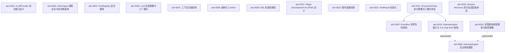

# ADR 关联性分析（自动生成）

> 本文件由 `tools/adr_relationships.py` 自动生成，**请勿手动编辑**。
> 任何手动修改会在下次运行时被覆盖。
> 最后更新: 由 `tools/adr_relationships.py` 生成（运行时刻见 git commit 时间戳）
> ADR 总数: 16

---

## 一、状态总览

| ADR | 议题 | 状态 | 日期 | 替代关系 |
|-----|------|------|------|---------|
| adr-0001 | ILLMProvider 流式接口设计 | ✅ Approved | 2026-05-28 |  |
| adr-0002 | EventBus 有界队列架构 | ✅ Approved | 2026-05-27 |  |
| adr-0003 | DSLEngine 线程安全与多实例架构 | ✅ Approved | 2026-05-12 |  |
| adr-0004 | ToolRegistry 安全模型 | ✅ Approved | 2026-05-27 |  |
| adr-0005 | LLM 后端配置与工厂模式 | ✅ Approved | 2026-05-12 |  |
| adr-0006 | HarnessEngine 后台线程模型 | ⛔ Superseded | 2026-05-25 |  |
| adr-0007 | 上下文压缩机制 | 🟡 Partial | Unknown |  |
| adr-0008 | 结构化 Context | ✅ Approved | Unknown |  |
| adr-0009 | DSL 标准库规划 | ✅ Approved | 2026-05-12 |  |
| adr-0019 | IInteractionBus 接口与 TUI Chat MVP 架构 | ✅ Approved | Unknown | 替代 adr-0006 |
| adr-0020 | 多智能体线程模型与隔离策略 | 🟡 Partial | 2026-06-08 | 替代 adr-0006 |
| adr-0021 | Plugin Development Kit (PDK) 设计 | 🔍 Proposed | 2026-05-25 |  |
| adr-0022 | 插件加载机制 | 🔍 Proposed | 2026-05-25 |  |
| adr-0023 | ToolResult 标准化 | 🟡 Partial | Unknown |  |
| adr-0031 | IExecutionPolicy 执行策略与三模式审批 | 🟡 Partial | Unknown |  |
| adr-0033 | Session Hierarchy 执行会话层级体系 | 🟡 Partial | Unknown |  |

---

## 二、依赖关系图

> 图中包含 16 个节点、2 条依赖边、2 条替代边。
> 渲染说明：实线 (`-->`) 表示依赖关系；虚线带标签 (`-.->|supersedes|`) 表示替代关系。

---

## 三、被引用次数（被引用方 ← 引用方）

| 被引用 ADR | 引用方 |
|------------|--------|
| adr-0002 | adr-0031 (depends-on) |
| adr-0006 | adr-0019 (supersedes), adr-0020 (supersedes) |
| adr-0019 | adr-0031 (depends-on) |

---

## 四、按状态统计

| 状态 | 数量 |
|------|------|
| ✅ Approved | 8 |
| 🟡 Partial | 5 |
| ⛔ Superseded | 1 |
| 🔍 Proposed | 2 |

---

## 五、按阶段分类（历史视角）

> ADR 编号反映历史阶段分类（参见 `.omo/plans/project-organization.md`）：
>
> - 0001-0009: 基础设施层（ILLMProvider/EventBus/DSLEngine/ToolRegistry/Context 等）
> - 0010-0014: 记忆系统（已大部分归档到 `docs/archive/adr/`）
> - 0015-0018: 推理引擎（已大部分归档）
> - 0019-0023: 智能体层（InteractionBus/ThreadModel/PDK/Plugin/ToolResult）
> - 0024-0028: 预留范围（无 ADR）
> - 0029+ 0030-0036: 异步/策略/路由/内核（大部分已归档）
>
> 当前活动 ADR 主要集中在 **0001-0009（基础）** 与 **0019-0033（智能体+策略）** 范围。
> 13 个已废弃 ADR 已归档到 `docs/archive/adr/`（参见 2026-06-12 Stage 2 / Task 7）。

