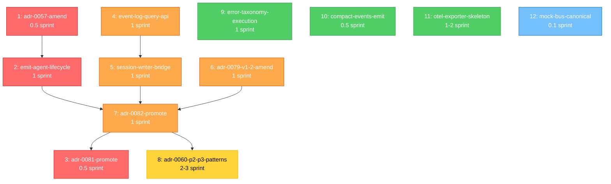

# 架构缺陷修复路线图（2026-08 v1.1）

**生成日期**: 2026-08-20
**最后验证**: 2026-08-20（基于 `defect-truth-table-2026-08.md` v1.1）
**作者**: Architecture Working Group
**状态**: ✅ Active — 修复执行路径

**关联文档**:
- `docs/architecture/defect-truth-table-2026-08.md` — 本路线图的依据（11 真实缺陷 + 3 盲点）
- `openspec/changes/` — 本路线图的 12 个提案落地位置
- `docs/architecture/adr-implementation-status-gap-analysis.md` — ADR 实施状态基线

---

## 一、概览

### 1.1 设计原则

| 原则 | 体现 |
|------|------|
| **rdd-workflow 提案为粒度** | 12 个提案对应 12 个 `openspec/changes/<name>/` 目录，每个含 proposal.md + design.md + roadmap-meta.yaml + specs/ + tasks.md |
| **依赖驱动顺序** | 12 个提案按硬依赖排序（无前置的 P0 最先启动） |
| **门控触发** | ADR 状态翻转（Proposed → Approved、Approved → 实施）作为阶段门控 |
| **可中断/可恢复** | 每个提案是原子单元，可独立 ship 或 rollback |
| **blast radius 控制** | 优先小提案（< 1 sprint），大提案（> 2 sprint）拆分 |

### 1.2 节点总览

| # | 提案 | Phase | 估时 | 前置 | 优先级 |
|---|------|-------|------|------|--------|
| 1 | `adr-0057-amend-lifecycle-events` | A | 0.5 sprint | 无 | P0 |
| 2 | `emit-agent-lifecycle-events` | A | 1 sprint | 1 | P0 |
| 3 | `adr-0081-promote-to-approved` | A | 0.5 sprint | 7（ADR-0082 解决核心争议） | P0（依赖 P1 链路） |
| 4 | `event-log-query-api` | B | 1 sprint | 无 | P1 |
| 5 | `session-writer-bridge` | B | 1 sprint | 4 | P1 |
| 6 | `adr-0079-v1-2-amend` | B | 1 sprint | 无 | P1 |
| 7 | `adr-0082-promote-to-approved` | C | 1 sprint | 5 + 6 | P1（关键路径） |
| 8 | `adr-0060-p2-p3-patterns` | C | 2-3 sprint | 无 | P2 |
| 9 | `error-taxonomy-execution-boundary` | D | 1 sprint | 无 | P1（盲点） |
| 10 | `compact-events-emit` | D | 0.5 sprint | 无 | P1（盲点） |
| 11 | `otel-exporter-skeleton` | D | 1-2 sprint | 无 | P2（盲点） |
| 12 | `mock-bus-canonical-extract` | E | 0.1 sprint | 无 | P3（工程债） |

**总估时**：≈ 12-15 sprint（6-7 个月）

### 1.3 关键路径

```
[1] adr-0057-amend ──→ [2] emit-agent-lifecycle ──┐
                                               │
                                               ↓
[6] adr-0079-v1-2-amend ──→ [7] adr-0082-promote ──→ [3] adr-0081-promote ──→ 缺陷 4.2 修复
[5] session-writer-bridge ──→ [7]
[4] event-log-query-api ──→ [5]
```

**真实最长路径**：`4 → 5 → 7 → 3`（1+1+1+0.5 = 3.5 sprint）或 `1 → 2 → 7 → 3`（0.5+1+1+0.5 = 3 sprint）
（Metis 评审修正：原"1 → 2 → 6 → 7 → 3"图论错误——P2 与 P6 之间无边）

---

## 二、依赖图（Mermaid）



---

## 三、Phase A — P0 立即可启动（≈ 2 sprint）

### 提案 1: `adr-0057-amend-lifecycle-events`

**openspec/changes/adr-0057-amend-lifecycle-events/**

**链接缺陷**：3.2（Agent 生命周期事件契约缺位）

**链接 ADR**：ADR-0057（Approved 但零事件契约）+ ADR-0068 ✅ Approved（附录 A 28 主题注册清单）

**Why**：

ADR-0057 ✅ Approved (2026-07-16) 但**只定义 5 个决策**（state machine / activation_events 懒加载触发器 / 冷切换 / 依赖检查 / 正交），**未定义任何生命周期发射事件**。Oracle + Metis 评审均确认这一点。ADR-0068 附录 A（28 主题注册清单）**无任何 `agent.*` 主题**。

本提案通过 ADR-0057 的 amendment 补齐发射事件定义：(1) 定义 4 个 `agent.*` 主题（`agent.spawned` / `agent.heartbeat` / `agent.terminated` / `agent.error`）；(2) 定义 payload schema；(3) ADR-0068 附录 A 注册。

**What Changes**：

- ADR-0057 文档 amendment（`docs/adr/adr-0057-agent-lifecycle.md`）：新增 §决策 6 "发射事件契约"，定义 4 个 `agent.*` 主题 + payload schema
- ADR-0068 附录 A amendment（`docs/adr/adr-0068-event-emission-contract.md`）：在 Registry 表中注册 4 个 `agent.*` 主题
- 新增 `tests/test_agent_lifecycle_topics.cpp`：4 主题 schema 校验 + 主题注册清单一致性测试

**Capabilities**：

- MUST 4 个 `agent.*` 主题定义与 ADR-0057 决策 6 + ADR-0068 附录 A **同步更新**（避免单边 drift）
- MUST payload schema 包含 `agent_descriptor`（AgentDescriptor V2 引用）+ `timestamp` + `causal_time`（与 EventLog v1.1 schema 对齐）
- SHOULD `agent.heartbeat` 默认间隔 = 30s（可配置），`agent.terminated` 与 `agent.error` 必须携带 exit code + reason
- MUST NOT 引入新 `agent.*` 主题命名冲突

**Impact**：

- ADR-0057 状态：🔍 Proposed amendment（不在主 ADR 状态翻转内）
- ADR-0068 状态：保持 ✅ Approved（仅追加附录 A 行）

**Acceptance**：

- [ ] ADR-0057 §决策 6 "发射事件契约" 写定（4 主题 + payload schema）
- [ ] ADR-0068 附录 A 注册 `agent.spawned` / `agent.heartbeat` / `agent.terminated` / `agent.error` 共 4 行
- [ ] `tests/test_agent_lifecycle_topics.cpp` ≥ 4 cases（每主题 1 case）
- [ ] `openspec validate adr-0057-amend-lifecycle-events --strict` exit 0
- [ ] ctest 零回归（与 147/147 baseline 比对）

**估时**：0.5 sprint（文档修订 + 测试）

**前置**：无

---

### 提案 2: `emit-agent-lifecycle-events`

**openspec/changes/emit-agent-lifecycle-events/**

**链接缺陷**：3.2（Agent 生命周期事件契约缺位）的实施

**链接 ADR**：ADR-0057 amendment（提案 1）+ ADR-0041（PluginLoader lifecycle hooks ship）

**Why**：

ADR-0057 amendment 定义了 4 个 `agent.*` 主题 + payload schema，但**代码中仍无 emit 点**。本提案在 PluginLoader lifecycle 转换点（init/register/activate/deactivate/unload）+ CognitiveWorker spawn/D 路径加 emit，使 4 个主题成为真实事件流。

**What Changes**：

- `src/modules/plugin/plugin_loader.cpp`：5 个状态转换点 emit `agent.*` 事件（LOADED→initialized→registered→active→inactive→unloaded）
- `src/modules/cognitive/cognitive_worker.cpp`：CognitiveWorker spawn/stop 时 emit `agent.spawned`/`agent.terminated`
- `src/common/plugin/plugin_info.h`：可选 `heartbeat_interval_ms` 字段（默认 30000）
- 新增 `tests/test_agent_lifecycle_emit.cpp`：状态机转换 + 4 主题 emit 验证 + payload schema 一致性

**Capabilities**：

- MUST emit 调用遵守 ADR-0068 EventBuilder V2（`EventBuilder(topic, ToolResult).build()`）
- MUST `agent.*` 事件携带 `agent_id`（v1.1 EventLog schema 对齐）
- MUST `agent.heartbeat` 默认 30s 间隔，可通过 `PluginInfo::heartbeat_interval_ms` 覆盖
- SHOULD 状态转换 emit 集中到一个 helper 函数 `emit_agent_lifecycle_event(state, info)`，便于扩展

**Impact**：

- 性能影响：每 PluginLoader 加载触发 ≤ 5 emit；30s heartbeat × N plugin = N/30 emit/s；高频事件需 EventLog 批量写入保护
- 与 ADR-0080 集成：事件流经 EventLogWriter 自动落盘（已 ship）

**Acceptance**：

- [ ] `src/modules/plugin/plugin_loader.cpp` 5 处状态转换 emit 调用点
- [ ] `src/modules/cognitive/cognitive_worker.cpp` 2 处（spawn/terminate）emit 调用点
- [ ] `tests/test_agent_lifecycle_emit.cpp` ≥ 6 cases（每状态转换 1 case + heartbeat 节流 + payload schema）
- [ ] ctest 全量零回归
- [ ] EventLog 集成测试（test_event_log_capture）显示 `agent.*` 事件落盘

**估时**：1 sprint（实施 + 测试 + 文档）

**前置**：提案 1（ADR-0057 amendment 写定才能有 schema 定义）

---

### 提案 3: `adr-0081-promote-to-approved`

**openspec/changes/adr-0081-promote-to-approved/**

**链接缺陷**：4.2（缺 pre-step hook（Agent 级拦截））

**链接 ADR**：ADR-0081（Proposed Agent pre-step hook）+ ADR-0082（需先解锁搁置）+ ADR-0069（Tool hooks ✅ Partial ship）

**Why**：

ADR-0081 🔍 Proposed (2026-08-12) 定义 Agent 级 pre-step hook，**推迟到 ADR-0082 定稿**（Agent-scoped vs LLM-scoped 两种设计对消费者 API 影响差异大）。Tool hooks（ADR-0069）✅ Partial ship 已提供中间验证。本提案将 ADR-0081 从 Proposed 翻牌 Approved，前提是提案 7（ADR-0082 定稿）已完成核心争议解决。

**What Changes**：

- ADR-0081 文档修订：从 Proposed → Approved 状态翻转；补充 §实施证据（引用提案 7 的 ADR-0082 决议）；补充 §不变量（与 ADR-0069 Tool hooks 严格正交）
- 引入 AgentPreStepHookRegistry L3 契约（`include/agenticdsl/contract/iagent_hook_registry.h`），与 ADR-0069 的 IToolHookRegistry 同位

**Capabilities**：

- MUST ADR-0081 决策 7 条件 5（ctest 零回归 + adr_lint 0 错误）满足
- MUST 与 ADR-0069 Tool hooks 严格区分（Tool 调用前 vs Agent step 前）
- SHOULD 复用 ADR-0069 的 `HookErrorPolicy`（FailClosed / FailOpen）设计，避免双轨

**Impact**：

- ADR-0081 状态：🔍 Proposed → ✅ Approved
- 不引入新代码（仅文档修订 + 状态翻转 + L3 契约设计）
- 为提案 13+（实施 Agent hooks）奠基

**Acceptance**：

- [ ] ADR-0081 §决策 7 转 Approved 条件全部满足
- [ ] ADR-0081 §实施证据指向 ADR-0082（提案 7）的定稿结论
- [ ] `include/agenticdsl/contract/iagent_hook_registry.h` 头文件创建（仅接口，无实现）
- [ ] `openspec validate adr-0081-promote-to-approved --strict` exit 0
- [ ] `tools/adr_lint.py` 0 errors

**估时**：0.5 sprint（文档修订 + L3 契约设计）

**前置**：提案 7（ADR-0082 解决 5 个核心争议）

---

## 四、Phase B — P1 前置依赖完成（≈ 4 sprint）

### 提案 4: `event-log-query-api`

**openspec/changes/event-log-query-api/**

**链接缺陷**：2.1（EventLog 不完整——query 缺失）

**链接 ADR**：ADR-0080 v1.1 ✅ Approved（D5 API 定义）+ ADR-0068（事件 schema）

**Why**：

ADR-0080 D5 定义了 EventLog API（emit / flush_sync / read / query），但 `EventLogWriter::read()` 是 stub（`event_log.cpp:178` 注释"占位实现：不在本 ADR 范围"）。离线分析、跨会话事件聚合、agent 学习三大场景依赖 query API——**EventLog 能写不能读**，闭环断裂。

**What Changes**：

- `src/core/event_log.cpp`：`read()` 实现（按 `agent_id` + 时间窗范围读取 JSONL）+ `query(filter)` 实现（内存中按 predicate 过滤）
- `src/core/event_log.h`：API 完整化（返回 `std::vector<BusEvent>` + `optional<error_code>`）
- `src/core/types/event_log_config.h`：扩展 `query` 相关配置（max_result_count / default_time_window）
- 新增 `tests/test_event_log_query.cpp`：read 路径（5 cases）+ query 路径（5 cases）+ 空结果 + 大结果集（10000 events）

**Capabilities**：

- MUST `read(agent_id, start_ts, end_ts)` 按因果时间窗读取（causal_time 而非 ts_wall，避免 bus 顺序问题）
- MUST `query(filter, max_count)` 内存过滤，max_count 默认 1000
- MUST 错误返回 `std::expected<BusEvent, ErrorCode>`（与 ErrorCode 体系对齐）
- MUST NOT 修改 write 路径（emit/flush_sync 行为不变）
- SHOULD 大日志场景提供 SQLite sidecar（提案 11 OTel 之外的可选）

**Impact**：

- 性能影响：query 在内存中 O(n) 过滤，万级事件可接受（< 100ms）；百万级需 SQLite sidecar
- 与 ADR-0080 v1.1 D12 兼容：opt-in + fail-closed 保持

**Acceptance**：

- [ ] `read()` 实现 + 与 stub 的差异性测试
- [ ] `query()` 实现 + filter 表达式支持（topic / agent_id / time window）
- [ ] `tests/test_event_log_query.cpp` ≥ 10 cases
- [ ] ctest 全量零回归
- [ ] 性能基准：10000 events query < 100ms（`tests/perf/test_event_log_query_perf.cpp`）

**估时**：1 sprint

**前置**：无（独立可启动）

---

### 提案 5: `session-writer-bridge`

**openspec/changes/session-writer-bridge/**

**链接缺陷**：2.1（EventLog 不完整）+ 1.1（4 套会话存储）

**链接 ADR**：ADR-0079 v1.1（SessionWriter）+ ADR-0080 v1.1（D3 EventLog 与 SessionWriter 并行订阅）

**Why**：

ADR-0080 D3 规定 EventLog（系统级全量事件）+ SessionWriter（会话级结构事件子集）并行订阅 bus，职责严格分离（ADR-0079 v1.1 附录 A.1）：Session 存骨架 + 指针，EventLog 存字节。本提案实施 SessionWriter 基础设施并接入 bus，与 EventLogWriter 协调测试无冲突。

**What Changes**：

- 新建 `src/core/session_writer.{h,cpp}`：append / build_context / fork / compact API
- `src/core/engine.cpp`：DSLEngine 构造时 `enable_session_writer()`（opt-in，对称 `enable_event_log()`）
- `src/core/types/session_writer_config.h`：配置（writer_dir + version_policy）
- 新建 `tests/test_session_writer.cpp`：4 scope schema + 与 EventLogWriter 并行写入 + crash 恢复
- 新建 `tests/test_session_writer_eventlog_integration.cpp`：同一 session 的骨架与字节一致性（spec §附录 A.1）

**Capabilities**：

- MUST 写入遵循 ADR-0079 v1.1 §决策 D1（单 JSONL 流 per conversation）
- MUST 写入话题清单（ADR-0079 §决策 D6 表 11 topic）严格遵守——非清单内的事件不写入
- MUST 写入 payload 与 EventLog 对应事件 `event_id` 关联（`event_ref` 字段）——ADR-0079 v1.1 §附录 A 字段
- MUST 失败语义原子性：write + fsync 单次原子
- SHOULD 与 EventLog 共同实现 "replay-from-skeleton + bytes-from-log" 蒸馏路径

**Impact**：

- SessionWriter 是 ADR-0079 v1.1 全部决策的实施入口；Phase 1 ship 是 v1.1 落地的先决条件
- 4 套会话存储的收敛起点：其他 3 套后续逐步迁移到 SessionWriter

**Acceptance**：

- [ ] SessionWriter 实现 + 4 scope schema 写定
- [ ] 与 EventLogWriter 并行订阅 bus 测试（无冲突）
- [ ] `tests/test_session_writer.cpp` ≥ 8 cases
- [ ] `tests/test_session_writer_eventlog_integration.cpp` ≥ 4 cases
- [ ] ctest 全量零回归
- [ ] docs/active-status.md §一 Phase 6c+ 状态行更新

**估时**：1 sprint

**前置**：提案 4（EventLog query API 落地，否则消费侧无法验证）

---

### 提案 6: `adr-0079-v1-2-amend`

**openspec/changes/adr-0079-v1-2-amend/**

**链接缺陷**：1.2 / 1.3 / 1.5 / 1.1（4 套并存中的部分）

**链接 ADR**：ADR-0079 v1.1 ✅ Approved

**Why**：

ADR-0079 v1.1 已批准 4-Scope 模型 + SessionWriter，但**未明确处理**：(1) message-index 寻址脆性（SessionStore::branch 用位置）；(2) branch cursor 语义（现有 `get_branch_leaf` 是查询，不是持久化游标）；(3) path-extraction fork（现有 SessionStore::branch 是拷贝前缀，不是 Pi 风格路径提取）；(4) 4 套存储的语义冲突分析（SessionRegistry 命名空间碰撞）。

本提案修订 ADR-0079 到 v1.2：

- **D7**：node-id 为唯一稳定寻址，message-index deprecated
- **D8**：branch cursor formalize（持久化位置状态，可回退）
- **D9**：path-extraction fork = `extract(node_id)` 创建 `<parent>-fork-<n>.v1.jsonl`（Pi 模式）
- **D10**：4 套存储语义冲突分析 + SessionRegistry 与 SessionManager 命名空间分配

**What Changes**：

- ADR-0079 文档修订：v1.1 → v1.2（新增 §决策 D7-D10 + §附录 D.1 compact 时代错位说明）
- ADR-0079 §附录 D 更新（API 兼容性表：v1.2 加 `extract()` / `checkout()` API）
- 新建 `tests/test_session_node_id_addressing.cpp`：node-id 寻址 vs message-index 寻址对比（迁移前后）
- 新建 `tests/test_session_extract_fork.cpp`：path-extraction fork + 多文件 header parent 引用

**Capabilities**：

- MUST D7 明确 SessionStore::branch(src, msg_index) 标记 `[[deprecated]]`，shim 内部 index→node_id 换算
- MUST D8 branch cursor 持久化字段定义（与 D9 路径提取的 header 字段对齐）
- MUST D9 `extract()` 返回新 file_id，header 含 `parent_file_id` + `branch_at_node_id`
- MUST D10 命名空间规则：SessionRegistry.id 命名空间 `sreg:<uuid>`，SessionManager.file_id 命名空间 `sm:<uuid>`——避免碰撞
- MUST 现有 147 个测试 0 零回归（除 SessionStore shim 兼容测试）

**Impact**：

- ADR-0079 状态：v1.1 → v1.2
- 提案 5（SessionWriter 实施）需遵循 v1.2 新增 D7-D10 字段
- 提案 7（ADR-0082 定稿）的 5 个核心争议中"R1: Session 语义统一"由本提案解决

**Acceptance**：

- [ ] ADR-0079 v1.2 写定（§决策 D7-D10 + §附录 D）
- [ ] SessionStore::branch 标记 `[[deprecated]]` + shim 实现
- [ ] `tests/test_session_node_id_addressing.cpp` ≥ 6 cases
- [ ] `tests/test_session_extract_fork.cpp` ≥ 6 cases
- [ ] ctest 全量零回归 + SessionStore shim 兼容测试通过

**估时**：1 sprint（文档修订 + 测试）

**前置**：无（独立可启动）

---

## 五、Phase C — P1 关键路径（≈ 3-4 sprint）

### 提案 7: `adr-0082-promote-to-approved`

**openspec/changes/adr-0082-promote-to-approved/**

**链接缺陷**：3.1（Agent 非 first-class）—— **关键路径节点**

**链接 ADR**：ADR-0082 🔍 Proposed（讨论稿 5 个核心争议未解）

**Why**：

ADR-0082 (v1.1, 2026-08-12) 搁置至 ADR-0079 + ADR-0080 实施后。本提案在两者 ship 后推动 ADR-0082 从 Proposed → Approved，需**先解决 5 个核心争议**（ADR-0082 §决策 7 未列）：C1-C5。

**5 个核心争议**（基于 ADR-0082 已知挑战，需在 OpenSpec change 中逐一决议）：

- **C1**：Agent 标识（字符串 ID vs typed ID vs UUID）
- **C2**：Agent 生命周期归属（per-engine vs per-worker vs per-tenant）
- **C3**：Agent 状态持久化（内存 vs EventLog vs SessionWriter）
- **C4**：Agent marketplace 接口契约（plugin 形态 vs subprocess 形态）
- **C5**：与 ADR-0022/0069/0081 的集成边界（plugin hook vs tool hook vs agent hook）

**What Changes**：

- ADR-0082 文档修订：Proposed → Approved；补充 §决策 7 决议（C1-C5 各自的最终决议）
- 新建 `include/agenticdsl/contract/iagent_registry.h` L3 契约（`register_agent(string_id, factory_fn)` / `create(string_id)` / `unregister(string_id)`）
- 新建 `tests/test_agent_registry.cpp`：5 争议对应的 5 case 验证

**Capabilities**：

- MUST C1 决议：字符串 ID（"react-loop-v1"），与 PluginInfo::name 对齐
- MUST C2 决议：per-engine 注册（与 ADR-0022 对齐），per-worker 隔离（与 ADR-0020 对齐）
- MUST C3 决议：状态持久化通过 EventLog + SessionWriter 双重事件流
- MUST C4 决议：plugin 形态为主（与 ADR-0022 兼容），subprocess 形态 Phase 2 考虑
- MUST C5 决议：plugin hook (ADR-0022) + tool hook (ADR-0069) + agent hook (ADR-0081) 三层正交

**Impact**：

- ADR-0082 状态：🔍 Proposed → ✅ Approved
- 解锁 ADR-0081（提案 3）推动定稿
- 解锁 ADR-0060 Phase 2（提案 8）实施依据

**Acceptance**：

- [ ] ADR-0082 §决策 7 决议记录（C1-C5 各自 final）
- [ ] `include/agenticdsl/contract/iagent_registry.h` 头文件创建
- [ ] `tests/test_agent_registry.cpp` ≥ 5 cases（每争议 1 case）
- [ ] `openspec validate adr-0082-promote-to-approved --strict` exit 0
- [ ] ADR-0081 §实施证据 + ADR-0060 §实施证据更新

**估时**：1 sprint（5 争议需要架构组评审决议时间）

**前置**：提案 5（SessionWriter 实施）+ 提案 6（ADR-0079 v1.2 修订）

---

### 提案 8: `adr-0060-p2-p3-patterns`

**openspec/changes/adr-0060-p2-p3-patterns/**

**链接缺陷**：3.3（Agent↔Agent 协议缺失）

**链接 ADR**：ADR-0060 ✅ Approved（6 模式 scope；2/6 实施）

**Why**：

ADR-0060 决策 4 表格定义 6 模式：① call ② call_async ③ emit ④ delegate ⑤ parallel ⑥ stream。代码实际实施 2/6（parallel + pub/sub）。模式 ①②③④⑤ 是 ADR scope 声明（✅），实际 ship 是另一回事——ADR 表与代码真相之间存在"scope vs 实施"标记混淆（Oracle 评审指出这是 ADR-0060 的 dishonest）。

本提案实施模式 ①②④（call 同步 RPC 已有但需 formal contract / call_async 异步 / delegate 任务委派）+ 模式 ⑥ stream（Phase 2 之前）。

**What Changes**：

- `include/agenticdsl/contract/iagent_composition.h`：4 个新模式接口
  - `call(agent_id, args) → Result<T, ErrorCode>`（同步）
  - `call_async(agent_id, args, callback) → future<Result<T, ErrorCode>>`
  - `delegate(agent_id, task, priority) → TaskHandle`
- `src/modules/cognitive/agent_composition.cpp`：4 模式实现（复用 DomainWorkerPool Sprint 3 并发能力）
- ADR-0060 amendment：明确 scope vs 实施标记（✅ 列改为 `scope: yes / impl: partial`）
- 新增 `tests/test_agent_composition.cpp`：4 模式 × 3 case = 12 case

**Capabilities**：

- MUST 4 模式接口与 ADR-0060 决策 4 表格严格对齐（不接受 scope vs impl 混淆）
- MUST call_async 返回 `std::future<Result>` + cancel 支持
- MUST delegate 优先级调度（high/normal/low）
- SHOULD stream 模式 Phase 2 占位（接口头 + TODO 实现）

**Impact**：

- ADR-0060 状态保持 ✅ Approved（实施率从 2/6 → 6/6 模式签名完整，2/6 模式实际可用）
- 解决盲点 7.1（错误传播）相关——call/call_async 返回 `Result<T, ErrorCode>` 强类型

**Acceptance**：

- [ ] 4 模式接口头文件 + 实现
- [ ] `tests/test_agent_composition.cpp` ≥ 12 cases
- [ ] ADR-0060 amendment 写定（scope vs impl 标记）
- [ ] ctest 全量零回归

**估时**：2-3 sprint

**前置**：无（业务需求驱动，可独立启动；ADR-0082 定稿后会自然受益）

---

## 六、Phase D — 盲点修复（≈ 3 sprint）

### 提案 9: `error-taxonomy-execution-boundary`

**openspec/changes/error-taxonomy-execution-boundary/**

**链接缺陷**：盲点 7.1（ExecutionResult 错误分类不连续）

**链接 ADR**：ADR-0023（ToolResult 标准化）+ ADR-0033 §D10（失败模式判定）

**Why**：

代码中存在两个同名 `ExecutionResult` 结构体（`src/core/types/budget.h:116` + `execution_session.h:89`），都用 `std::string message` 承载错误，无 ErrorCode 枚举字段。`record_failure`（`session.cpp:62-67`）注释："ExecutionResult 没有 error_code 字段…默认失败总是递增（保守策略）"——设计意图"仅可重试错误递增"未实现。

**What Changes**：

- `src/core/types/budget.h`：删除重复 `ExecutionResult` 定义，include 统一类型
- `src/core/types/execution_result.h`（新建）：统一 `ExecutionResult<T>` 模板，含 `ErrorCode` 枚举字段
- `src/core/types/session.cpp`：`record_failure` 按 ErrorCode 分流（Retryable 递增，Non-retryable 不递增）
- 新增 `tests/test_execution_result_error_taxonomy.cpp`：3 类错误（Retry/Timeout/PermissionDenied）× 3 路径（Retry/Success/PermanentFail）= 9 case

**Capabilities**：

- MUST `ExecutionResult<T>` 含 `ErrorCode` 字段（非 `std::string`）
- MUST `record_failure` 按 `is_retryable_error(ErrorCode)` 分流
- MUST `ErrorCode` 枚举覆盖 ADR-0023 已定义的全部 9 类（Network/RateLimited/ServerError/Auth/ContextOverflow/...）
- SHOULD 统一两个 ExecutionResult 定义后 `<T>` 模板支持

**Impact**：

- 与提案 8（ADR-0060 P2-P3）协同：`call_async` 返回 `Result<T, ErrorCode>` 复用本提案的统一类型
- 解决 retry 策略保守问题

**Acceptance**：

- [ ] `src/core/types/execution_result.h` 统一类型
- [ ] `record_failure` 按 ErrorCode 分流
- [ ] `tests/test_execution_result_error_taxonomy.cpp` ≥ 9 cases
- [ ] ctest 全量零回归
- [ ] 旧 `ExecutionResult` 引用方全部迁移

**估时**：1 sprint

**前置**：无（独立可启动；与提案 8 协同增益）

---

### 提案 10: `compact-events-emit`

**openspec/changes/compact-events-emit/**

**链接缺陷**：盲点 7.2（`context.compact.before/after` 事件幻影）

**链接 ADR**：ADR-0007（context compression）✅ + ADR-0068（事件发射契约）✅ + ADR-0080 v1.1

**Why**：

ADR-0007 ✅ Approved + ship (2026-08-13) 实现 context compaction，但 ADR-0068 附录 A Canonical Topic Registry 中 `context.compact.before/after` 仍标 👻——compaction 事件**未发射**。compaction 发生时消息被丢弃，无法审计；Context 压缩时丢消息，agent 调试时无法回溯。

**What Changes**：

- ADR-0068 附录 A amendment：注册 `context.compact.before` / `context.compact.after` 2 主题 + payload schema（`context_snapshot_ref` + `token_count_before` + `token_count_after` + `policy_version`）
- `src/common/context_compactor.cpp`：compaction 前后 emit 事件（before 时含 pre-compaction context size，after 时含 post-compaction summary ref）
- 新增 `tests/test_context_compact_events.cpp`：before/after 事件 schema + 与 EventLog 集成

**Capabilities**：

- MUST 2 主题 payload 与 ADR-0068 附录 A 一致
- MUST compaction 必须有 `before` 才有 `after`（保证事件配对）
- SHOULD `after` 携带 `compacted_summary` reference，与 SessionWriter `CompactionEntry` 关联

**Impact**：

- ADR-0068 附录 A：从 28 主题 → 30 主题
- ADR-0007 状态：✅ Approved（保持）
- 与提案 4（EventLog query API）协同：query compact 事件可重建压缩历史

**Acceptance**：

- [ ] ADR-0068 附录 A 注册 2 主题
- [ ] `src/common/context_compactor.cpp` 2 处 emit
- [ ] `tests/test_context_compact_events.cpp` ≥ 4 cases
- [ ] ctest 全量零回归

**估时**：0.5 sprint

**前置**：无（独立可启动；与提案 4 协同）

---

### 提案 11: `otel-exporter-skeleton`

**openspec/changes/otel-exporter-skeleton/**

**链接缺陷**：盲点 7.3（ADR-0063 OTel exporter 零代码）

**链接 ADR**：ADR-0063 ✅ Approved（OpenTelemetry tracing）

**Why**：

ADR-0063 ✅ Approved 但**实施 0%**——可观测性出口完全缺失。EventLog 是项目内 JSONL，OTel 是工业标准（Jaeger/Prometheus/Tempo）。分布式追踪 / 跨主机 agent 追踪无标准出口。

**What Changes**：

- 新建 `src/common/observability/otel_exporter.{h,cpp}`：OTel span exporter（订阅 EventLog + 转换为 OTel span）
- 新建 `src/common/observability/otel_config.h`：OTel 配置（endpoint / protocol: grpc|http)
- `CMakeLists.txt`：可选依赖 `opentelemetry-cpp`（`find_package(OpenTelemetry)` + `target_link_libraries`）
- 新建 `tests/test_otel_exporter.cpp`：mock OTel collector + 验证 span emit（5 cases）

**Capabilities**：

- MUST span 包含 `agent_id` + `session_id` + `trace_id` 三个属性（与 EventLog schema 对齐）
- MUST 订阅 EventLog 的 `llm.*` / `tool.*` / `agent.*` / `dsl.*` 4 类事件
- MUST opt-in + fail-closed（与 EventLog opt-in 模型一致）
- SHOULD 支持 OTLP/gRPC 和 OTLP/HTTP 双协议
- SHOULD protobuf payload 与 EventLog v:1 schema 兼容

**Impact**：

- ADR-0063 状态：✅ Approved（保持）→ 实施率从 0% → skeleton
- 新增依赖 `opentelemetry-cpp`（CMake `find_package` + `FetchContent` fallback）
- 不破坏现有 API（纯增量）

**Acceptance**：

- [ ] `src/common/observability/otel_exporter.{h,cpp}` 实现
- [ ] CMake 集成（`AGENTICDSL_BUILD_OTEL=ON` opt-in）
- [ ] `tests/test_otel_exporter.cpp` ≥ 5 cases
- [ ] mock OTel collector 接收验证（4 类事件 × 1 case = 4）
- [ ] ctest 全量零回归（OTel 默认 OFF）

**估时**：1-2 sprint（含依赖集成 + 测试）

**前置**：无（独立可启动）

---

## 七、Phase E — 工程改进（≈ 0.1 sprint）

### 提案 12: `mock-bus-canonical-extract`

**openspec/changes/mock-bus-canonical-extract/**

**链接缺陷**：6.1（MockBus 重复 9 处，工程债）

**链接 ADR**：ADR-0019 🟡 Partial（IInteractionBus 接口）

**Why**：

`tests/` 和 `examples/` 下 9 处 MockBus 实现重复（见缺陷 6.1 列举）。生产代码 InMemoryBus 唯一，9 处测试 fixture 行为不一致导致断言语义分散。提取 `tests/test_helpers/mock_bus.h` 作为 canonical fixture。

**What Changes**：

- 新建 `tests/test_helpers/mock_bus.h`：canonical MockBus（继承 `IInteractionBus`，含事件 vector + sync/async subscribe）
- 9 处 MockBus 实现全部迁移到 canonical fixture（最小改动：删除本地 MockBus + include canonical + 调整类型引用）
- 新增 `tests/test_mock_bus_canonical.cpp`：canonical fixture 自测试（10 cases：单订阅 / 多订阅 / 同步 / 异步 / 过滤）

**Capabilities**：

- MUST 9 处现有测试**不改断言**（仅换 fixture 实现）
- MUST canonical MockBus 提供同步 + 异步两种 subscribe 模式（与 InMemoryBus 行为对齐）
- SHOULD canonical MockBus 含事件过滤（topic glob / agent_id / time range）

**Impact**：

- 测试代码统一，断言语义一致
- 不影响生产代码

**Acceptance**：

- [ ] `tests/test_helpers/mock_bus.h` 实现
- [ ] 9 处现有 MockBus 全部迁移到 canonical fixture
- [ ] `tests/test_mock_bus_canonical.cpp` ≥ 10 cases
- [ ] ctest 全量零回归（现有测试不改断言）

**估时**：0.1 sprint（5h 工程任务）

**前置**：无（独立可启动）

---

## 八、跨切关注（Cross-Cutting Concerns）

### 8.1 测试策略

- 单元测试（每个提案自带）
- 集成测试（EventLog + SessionWriter 集成——提案 5）
- 回归测试（每提案 ctest 全量零回归作为 ship gate）
- 性能基准（提案 4 EventLog query 性能 / 提案 5 SessionWriter 写入吞吐）

### 8.2 文档同步

每个提案 ship 时同步：
- `docs/architecture/defect-truth-table-2026-08.md`：缺陷状态更新（实施率从 0% → 50% / 100%）
- `docs/architecture/defect-fix-roadmap-2026-08.md`（本文）：实施证据更新
- `docs/active-status.md`：Sprint 状态行
- `docs/architecture/adr-implementation-status-gap-analysis.md`：ADR 状态更新

### 8.3 兼容性保证

| 兼容维度 | 保证 |
|---|---|
| API 兼容性 | SessionStore shim 保留 4 个语义保证（单例 / index 寻址 / 拷贝分叉 / non-mutating compact） |
| 二进制兼容性 | 不修改 ABI（PluginInfo V2 保持；新字段通过 `dependencies[256]` 扩展） |
| 数据兼容性 | JSONL 文件版本化 header；load-time 惰性迁移 |
| 测试兼容性 | 9 处 MockBus 迁移不改断言；147/147 baseline 零回归 |

### 8.4 可观测性

- EventLog 是核心审计日志（ADR-0080）
- OTel exporter 提供工业标准出口（提案 11）
- SessionWriter 提供会话结构骨架（提案 5）
- 三层职责严格分离（ADR-0079 v1.1 §附录 A.1）

---

## 九、风险登记

| # | 风险 | 概率 | 影响 | 缓解 |
|---|------|------|------|------|
| 1 | ADR-0057 amendment 引发 ADR 治理摩擦 | 中 | 中 | 提案 1 限定为 §决策 6 追加，不修改主 ADR 决策 1-5 |
| 2 | ADR-0082 5 个核心争议无法在 1 sprint 内解决 | 中 | 高 | 架构组提前预审；如确实阻塞则拆分 C1-C5 各自独立 OpenSpec change |
| 3 | SessionWriter 与 EventLog 并行写入冲突 | 低 | 高 | 提案 5 含集成测试（test_session_writer_eventlog_integration） |
| 4 | EventLog query 性能不达标 | 中 | 中 | 提案 4 限定万级事件 < 100ms；百万级推迟到 SQLite sidecar |
| 5 | OTel 依赖集成失败 | 中 | 中 | 提案 11 opt-in + CMake `find_package` + FetchContent fallback |
| 6 | MockBus 迁移引发测试断言失败 | 低 | 低 | 提案 12 不改语义，仅换 fixture |
| 7 | 12 提案并行导致 ship 顺序混乱 | 中 | 中 | 依赖图驱动 + Sprint 顺序锁定 |

---

## 十、显式推迟（不在本路线图范围）

| # | 事项 | 推迟理由 | 何时重启 |
|---|------|---------|---------|
| 1 | ADR-0082 C4 subprocess 形态 agent | Phase 2 评估 | marketplace 需求出现时 |
| 2 | OTel SQLite sidecar（百万级 query） | 性能需求未到 | 单 agent EventLog > 100k events 时 |
| 3 | ADR-0077 gRPC Data Plane | Wave 4 docs-only | Wave 4 启动时 |
| 4 | ADR-0078 Fine-tune 基模与训练管线 | Wave 5+ docs-only | Wave 5+ 启动时 |
| 5 | ADR-0076 DSL Engine as MCP Server | gated by active-status.md §四 | Phase 7 Control Plane 启动时 |
| 6 | C++26 `std::execution` 观望 | 标准未定 | C++26 标准化后 |
| 7 | ADR-0079 §不变量 2 compact 决策（绝对 append-only vs 保留例外） | 需独立讨论 | 提案 6 v1.2 实施时并行 |
| 8 | 缺陷 2.2 剩余：Canonical Topic Registry payload 校验自动化 | 非阻塞，无需新 proposal | 缺陷归属 proposal 完成后 |
| 9 | 缺陷 4.1 open gap：ADR-0022 per-engine 注册已 ship，per-agent 未 ship | 非阻塞，提案 7 C2 决议（per-engine + per-worker）概念部分覆盖 | ADR-0082 实施时并行 |
| 10 | 缺陷 5.1 open gap：ADR-0020 jthread+stop_token 已 ship，scope tree 未 ship | 非阻塞，提案 7 C2 决议概念覆盖 | ADR-0082 实施时并行 |
| 11 | ADR-0081 后续实施（Agent hook 实现） | 本路线图仅翻牌到 Approved + L3 契约头文件 | Sprint 24+ 独立 OpenSpec change |
| 12 | ADR-0082 后续实施（AgentRegistry 完整实现） | 本路线图仅翻牌到 Approved + L3 契约头文件 + 最小 in-memory 参考实现 | Sprint 24+ 独立 OpenSpec change |
| 13 | ADR-0060 stream 模式完整实现 | 本路线图仅占位接口 + throw | Sprint 24+ 独立 OpenSpec change |

---

## 十一、关联文档

- **依据**：`docs/architecture/defect-truth-table-2026-08.md`（v1.1，2026-08-20）
- **ADR 状态基线**：`docs/architecture/adr-implementation-status-gap-analysis.md`
- **缺失能力基线**：`docs/architecture/layer-based-missing-capabilities-analysis.md`
- **架构规范**：`docs/specs/architecture.md`（五层架构 L0-L4 + R1-R5）
- **OpenSpec 提案落位置**：`openspec/changes/<proposal-name>/`

---

**审批与维护**：
- 提议：2026-08-20（本会话）
- 维护者：架构组 + Sprint 收官机制
- 审查频率：每 Sprint 收官（`scripts/sprint-closeout.sh` Step 8 加本路线图交叉检查）
- 与 `defect-truth-table-2026-08.md` 双向验证（缺陷状态 ↔ 路线图实施证据）