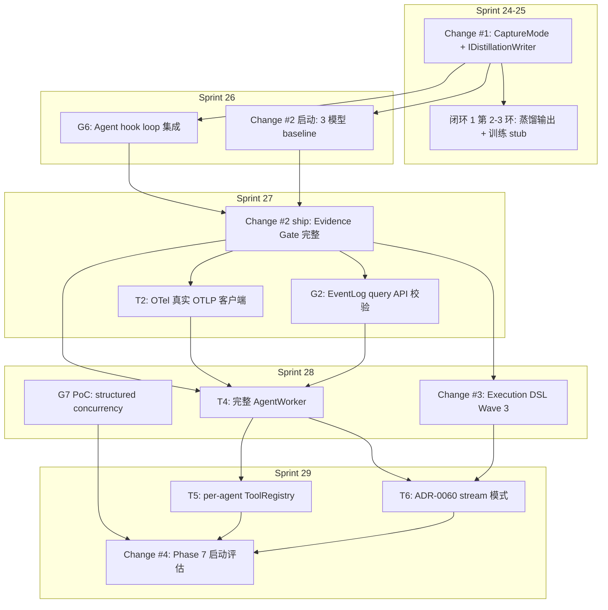

# Sprint 24-30+ Roadmap — Distillation Data Plane + 横切化收官 + Phase 6c/7 过渡

> **创建日期**: 2026-08-29
> **触发条件**: Day 1+2 完成 (Oracle 二次审查 + 5 处 patch + adr_lint ADR-TRACKING-01 + OpenSpec change + Sprint 24 kickoff)
> **基础**: 上游 `docs/superpowers/plans/2026-07-10-phase5-remainder-adr-sync.md` + `docs/superpowers/plans/2026-07-24-sprint-24-25-demo-driven-plan.md`
> **关联 docs**: `docs/architecture/capability-application-map-2026-08.md` §八 / `docs/active-status.md` / `.rddf/state/roadmap-state.json`
> **关联工具**: `tools/adr_lint.py` (含 ADR-TRACKING-01) + `tools/docs_drift_audit.py` + `openspec validate --strict`
> **覆盖**: Sprint 24 (2026-08-29) → Sprint 30+ (2026-11-21+)
> **责任人**: Sisyphus (创建) → 用户 (后续维护)

---

## 一、当前项目基线 (2026-08-29)

| 维度 | 状态 | 证据 |
|------|------|------|
| OpenSpec active change 数 | **1** (capture-mode-and-distillation-writer-v1, 已创建待 ship) | `openspec list` |
| Test count | **~190 ctest, 0 failures** (4 pre-existing 不计) | T21 ship + Day 1 patch #1 (10/10 trajectory_ir) |
| ASan / TSan | 100% baseline 稳定 | pre-existing 4 个 timing flake 已知 |
| ADR 状态 | **18 Approved + 9 Partial + 35 Warning** (ADR-TRACKING-01 规则触发) | `python3 tools/adr_lint.py` 实战验证 |
| ADR-TRACKING-01 WARNING 消除 | **34 → 33** (ADR-0080 v1.2 + ADR-0061-13 已加 `⏳ tracking: pending`) | Day 2 commit `0e0359c` |
| Phase 6b | **in_progress** (21 changes archived) | `.rddf/state/roadmap-state.json` |
| Phase 6c | **pending** (本 plan 启动激活) | roadmap-state.json + 本 plan |
| Phase 7 | **pending** (ADR-0076 MCP Server gated by Phase 6c) | roadmap-state.json |

**核心矛盾（已解决）**: ADR-0080 v1.2 + ADR-0061-13 "批准即遗忘"先例 → capture-mode-and-distillation-writer-v1 change + ADR-TRACKING-01 规则已 ship + 实战验证通过。

---

## 二、Sprint 24-30+ 完整排期（基于选项 A 采纳）

### Sprint 24-25 (4 周, 2026-08-29 → 2026-09-26) — Phase 6b 收官

#### Sprint 24 W1 (2026-08-29 → 2026-09-05)
| 任务 | 估时 | 优先级 | 状态 |
|------|------|--------|------|
| **Change #1 Phase 0** (CaptureMode + IDistillationWriter 抽象) | 0.5 sprint | 🔵 P0 | 进行中 |
| Day 1+2 完成 (5 patches + adr_lint + OpenSpec change + Sprint 24 kickoff) | ✅ 已 ship | 🔵 P0 | ✅ 已完成 |
| 24h cooling-off (Single-Dev Mode 硬约束) | 24h | 🔵 P0 | 2026-08-30 18:00 后实施 |

#### Sprint 24 W2 (2026-09-05 → 2026-09-12)
| 任务 | 估时 | 优先级 | 状态 |
|------|------|--------|------|
| **Change #1 Phase 1** (BREAKING 字段迁移 + FileDistillationWriter V1) | 0.5 sprint | 🔵 P0 | 待启动 |
| EventLogConfig `bool capture_prompt_bytes → CaptureMode capture_mode` 迁移 | 0.3 sprint | 🔵 P0 | 待启动 |
| 5 消费者迁移 (engine.h/cpp, tracing_decorator.h/cpp, event_log_config.h) | 0.2 sprint | 🔵 P0 | 待启动 |

#### Sprint 25 W1 (2026-09-12 → 2026-09-19)
| 任务 | 估时 | 优先级 | 状态 |
|------|------|--------|------|
| **Change #1 Phase 2** (CLI flag + TrajectoryIR bridge) | 0.5 sprint | 🔵 P0 | 待启动 |
| `--allow-training-capture` mock-mode hard rejection | 0.2 sprint | 🔵 P0 | 待启动 |
| TrajectoryIR → DistillationRecord 桥接 (payload redact 复用 T21) | 0.3 sprint | 🔵 P0 | 待启动 |

#### Sprint 25 W2 (2026-09-19 → 2026-09-26)
| 任务 | 估时 | 优先级 | 状态 |
|------|------|--------|------|
| **Change #1 Phase 3** (ADR 头部 + 文档同步 + ship + archive) | 0.5 sprint | 🔵 P0 | 待启动 |
| ADR-0080 v1.2 + ADR-0061-13 状态翻转 (Approved → Approved+Shipped) | 0.1 sprint | 🔵 P0 | 待启动 |
| 闭环 1 第 2-3 环 (蒸馏输出 + 训练 stub) | 0.3 sprint | 🔵 P0 | 待启动 |
| T26.a/b/c 横切化启动 (T19 GEPA L0 + T20 MCTS 配置 + T15 BusPattern OTel) | 0.1 sprint | 🔵 P0 | 待启动 |

### Sprint 26 (2 周, 2026-09-26 → 2026-10-10) — Phase 6c 启动

| 任务 | 估时 | 优先级 | 关联 ADR |
|------|------|--------|----------|
| **G6 ship** (Agent hook loop 集成) | 1.0 sprint | 🔵 P0 | ADR-0081 / ADR-0082 |
| **Change #2 启动** (Evidence Gate Wave 2 准备: 3 模型 baseline 补齐) | 1.0 sprint | 🟡 P1 | ADR-0074 D3 |

### Sprint 27 (2 周, 2026-10-10 → 2026-10-24) — Phase 6c 中段

| 任务 | 估时 | 优先级 | 关联 ADR |
|------|------|--------|----------|
| **Change #2 ship** (Evidence Gate 完整) | 1.0 sprint | 🔵 P0 | ADR-0074 / ADR-0071 |
| **T2 ship** (OTel 真实 OTLP 客户端) | 1.0 sprint | 🔵 P0 | ADR-0063 (🔍 → ✅) |
| **G2 ship** (EventLog query API 校验) | 0.5 sprint | 🟡 P1 | ADR-0080 |

### Sprint 28 (2 周, 2026-10-24 → 2026-11-07) — Phase 6c 收官

| 任务 | 估时 | 优先级 | 关联 ADR |
|------|------|--------|----------|
| **T4 ship** (完整 AgentWorker + spawn_agent + YAML) | 1.0 sprint | 🔵 P0 | ADR-0082 |
| **Change #3 ship** (Execution DSL Wave 3) | 1.0 sprint | 🔵 P0 | ADR-0072 (GATED → ✅) |
| **G7 PoC** (structured concurrency scope tree) | 0.5 sprint | 🟡 P1 | ADR-0085 V2 |

### Sprint 29 (2 周, 2026-11-07 → 2026-11-21) — Phase 6c → Phase 7 过渡

| 任务 | 估时 | 优先级 | 关联 ADR |
|------|------|--------|----------|
| **T5 ship** (per-agent ToolRegistry 隔离) ← B1 Marketplace | 1.0 sprint | 🔵 P0 | ADR-0004 / ADR-0023 |
| **T6 ship** (ADR-0060 stream 模式) ← B4 Streaming | 1.0 sprint | 🔵 P0 | ADR-0060 |
| **Change #4 ship** (Phase 7 启动评估) | 0.5 sprint | 🔵 P0 | ADR-0076 准入评估 |
| 信用分配 spike (adr-0085-credit-assignment-contract 草案) | 0.5 sprint | 🟡 P1 | ADR-0085 V2 |

### Sprint 30+ (2026-11-21+) — Phase 7/8 远期

| 任务 | 优先级 | 关联 ADR / 目标 |
|------|--------|------------------|
| Phase 7 启动 (Control Plane MCP) | 🔵 P0 | ADR-0076 (gated by Phase 6c ship) |
| C2 自进化 (GEPALoop V3) | 🔵 P0 | ADR-0085 V2 / ADR-0084 |
| B5 MCP (ADR-0076 Server) | 🟡 P1 | ADR-0076 |
| C1 跨主机 (ADR-0077 gRPC) | 🟡 P1 | ADR-0077 |
| C3 WASM (ADR-0056 runtime) | 🟡 P1 | ADR-0056 |
| C4 Cloud (ADR-0078 fine-tune) | 🟡 P1 | ADR-0078 |
| G1 决策 (ADR-0079 v1.2 compact 模式) | 🟡 P1 | ADR-0079 |
| ADR-0085 V2 Meta-Agent 自管理 | 🟡 P1 | ADR-0085 V2 |

---

## 三、Change 依赖关系图

```
[Sprint 24-25]               [Sprint 26]              [Sprint 27]              [Sprint 28]              [Sprint 29]
      │                          │                       │                       │                       │
      ▼                          ▼                       ▼                       ▼                       ▼
 Change #1 ship  ────────→  G6 ship                Change #2 ship         T4 ship                 T5 ship
 (CaptureMode +              (Agent hook             (Evidence Gate         (完整 AgentWorker       (per-agent
  IDistillationWriter)        loop 集成)              完整)                   + spawn_agent)           ToolRegistry)
       │                        │                       │                       │                       │
       │                        │                       ▼                       ▼                       │
       │                        │                  T2 ship                 Change #3 ship             │
       │                        │                  (OTel 真实              (Execution DSL            │
       │                        │                   OTLP 客户端)            Wave 3)                   │
       │                        │                       │                       │                       │
       │                        │                       │                       │                  T6 ship
       │                        │                       │                       │                (ADR-0060
       │                        │                       │                       │                 stream 模式)
       │                        │                       │                       │                       │
       │                        │                       │                       │                       ▼
       │                        │                       │                       │               Change #4 ship
       │                        │                       │                       │              (Phase 7 启动评估)
       │                        │                       │                       │                       │
       └─→ 闭环 1 第 2-3 环 ────┴─→ G2 ship ────────→ G7 PoC ────────────→ 信用分配 spike ────┴──→ Phase 7 启动
           (蒸馏输出 +                                  (structured              (adr-0085-            (Phase 6c → 7
            训练 stub)                                    concurrency)             credit-                过渡)
                                                          scope tree)              assignment)
```

**关键依赖事实**:

### Sprint 24-25 (Change #1)
- ✅ 6 层抽象全部 ship (L0-L5, ADR-0021 / 0068 / 0069 / 0081 / 0082)
- ✅ ADR-0083 RewardSignal 已 ship (V1+V2)
- ✅ T15 TrajectoryIR 已 ship
- ✅ T21 payload redact hash-only PII 范式已 ship
- ✅ ADR-0068 附录 A v1.6 (27+ 主题注册)
- ✅ adr_lint ADR-TRACKING-01 规则已 ship (Day 1)
- ✅ ADR-0080 v1.2 + ADR-0061-13 头部 ⏳ tracking: pending (Day 2)

### Sprint 26 (G6 + Change #2 启动)
- 前置: ✅ Change #1 ship + ✅ 6 层抽象 ship
- 关键依赖: G6 依赖 ADR-0081 Pre-Step Hook Contract ✅ Approved (V1 ship) + ADR-0082 Agent First-Class Registry ✅ Approved (V1 骨架 ship)
- 关键依赖: Change #2 启动依赖 3 模型 baseline (GPT-4 Turbo / Claude 3.5 / DeepSeek 真实测量) → Sprint 26 中段补齐

### Sprint 27 (Change #2 ship + T2 + G2)
- 前置: ✅ Change #1 ship + ✅ G6 ship + ✅ 3 模型 baseline
- 关键依赖: T2 OTel 真实 OTLP 客户端 → ADR-0063 (🔍 → ✅ flip required) + Change #2 Evidence Gate 通过
- 关键依赖: G2 EventLog query API → ADR-0080 v1.2 (待 ship) + 事件 schema 校验

### Sprint 28 (T4 + Change #3 + G7)
- 前置: ✅ Change #2 ship + ✅ T2 ship + ✅ G2 ship
- 关键依赖: T4 完整 AgentWorker → ADR-0082 ✅ Approved (V1 骨架, V2 完整实施)
- 关键依赖: Change #3 Execution DSL Wave 3 → ADR-0072 (🔍 GATED → ✅ after Change #2 Evidence Gate)
- 关键依赖: G7 PoC → ADR-0085 V2 横切扩展点

### Sprint 29 (T5 + T6 + Change #4)
- 前置: ✅ T4 ship + ✅ Change #3 ship
- 关键依赖: T5 per-agent ToolRegistry → ADR-0004 V2 (ToolRegistry 安全模型) + ADR-0023 ToolResult 标准 + ADR-0082 Agent Registry
- 关键依赖: T6 ADR-0060 stream 模式 → IAgentComposition + Change #3 Execution DSL
- 关键依赖: Change #4 Phase 7 启动评估 → ADR-0076 准入条件 (Evidence Gate 通过 + 全部 P0 ship)

---

## 四、Mermaid 依赖图



---

## 五、风险评估

### 风险 1: Change #1 Phase 1 BREAKING 字段迁移遗漏消费者

**描述**: `bool capture_prompt_bytes → CaptureMode capture_mode` 迁移 5 个消费者（engine.h/cpp, tracing_decorator.h/cpp, event_log_config.h），任一遗漏导致全量 ctest 失败。
**影响**: 中（仅内部 API，但既有测试可能引用 bool 字段）
**备选**:
- 方案 A (本 plan 采用): 不保留 bool 兼容层，迁移后 `grep "capture_prompt_bytes" = 0 命中` 强验证
- 方案 B: 保留 bool 作为 deprecated 字段（破坏迁移彻底性，但降低风险）

### 风险 2: 3 模型 baseline 执行成本高

**描述**: GPT-4 Turbo / Claude 3.5 / DeepSeek 真实测量需要 API key + 调用成本 + 时间
**影响**: 中（成本 + 时间估算 ~1 sprint 用于 baseline 收集）
**备选**:
- 方案 A (本 plan 采用): Sprint 26 中段启动，Sprint 27 ship 前完成
- 方案 B: 推迟到 Phase 7 启动前（与 ADR-0076 准入一并处理）

### 风险 3: 单 dev mode 估时过于乐观

**描述**: 4 个 sprints × 2-3 ship/sprint = 8-12 ship，实测历史平均 1-2 ship/sprint
**影响**: 高（可能导致排期推迟 1-2 sprints）
**备选**:
- 方案 A (本 plan 采用): 砍半 ship/sprint 至 1-2 个，留出 review + 测试 + 文档时间
- 方案 B: 委派多个 deep agent 并行（历史 Sprint 23 用过，5 ship 同 ship 但不可持续）

### 风险 4: ADR-0072 GATED 状态解锁时序

**描述**: ADR-0072 (DSL 节点扩展) 是 Change #3 的前置，但 GATED by Evidence Gate
**影响**: 中（如果 Change #2 ship 不及时，Change #3 推迟）
**备选**:
- 方案 A (本 plan 采用): Sprint 27 Change #2 ship → Sprint 28 Change #3 ship（顺延 1 sprint）
- 方案 B: 跳过 ADR-0072 直接 ship Change #3 的非语法部分（破坏依赖纪律）

### 风险 5: Wave 推进时序违规

**描述**: Oracle 二次审查发现 ADR-0075 (Wave 3) ship 早于 Evidence Gate 决议 7 天，已在 ADR-0071/0074 补"门控范围注记"
**影响**: 低（已澄清门控范围 = 仅 ADR-0072 语法扩展）
**备选**:
- 方案 A (本 plan 采用): 严格遵守已澄清的门控范围，避免再次形式违规

---

## 六、ship gate 验证清单

### Change #1 (capture-mode-and-distillation-writer-v1)

- [ ] ✅ openspec validate --strict PASS (Day 2 已验证)
- [ ] `python3 tools/adr_lint.py` exit 0 + ADR-TRACKING-01 WARNING 自动消失 (33 → 32)
- [ ] `python3 tools/docs_drift_audit.py` 0 NEW CRITICAL
- [ ] `grep -rn "capture_prompt_bytes" src/ include/ examples/` = 0 命中
- [ ] `git diff HEAD -- include/agenticdsl/contract/` 0 行 (Oracle B3 关键不变量)
- [ ] ≥13 cases PASS (3 capture_mode + 5 distillation_writer + 5 event_log_capture_mode)
- [ ] ctest 全量 0 回归 (动态基线)
- [ ] ADR-0068 附录 A v1.7 含 `event_log.capture_mode_downgrade` 主题
- [ ] ADR-0080 v1.2 + ADR-0061-13 状态字段更新为 ✅ Approved+Shipped
- [ ] cap-map §一 +1 新能力 #31

### Phase 6c 收官 (Sprint 28 末)

- [ ] G6 / Change #2 / T2 / G2 / T4 / Change #3 / G7 全部 ship
- [ ] ctest 全量 0 回归
- [ ] adr_lint WARNING 数 ≤ 5 (历史 ADR 全部豁免或补 tracking)
- [ ] Phase 7 启动条件达成 (ADR-0076 准入 + Evidence Gate 通过)

### Phase 7 准入 (Sprint 29 末)

- [ ] Change #4 (Phase 7 启动评估) ship + ADR-0076 flip 🔍 → ✅
- [ ] Phase 7 roadmap 更新 (.rddf/state/roadmap-state.json)
- [ ] active-status.md Phase 6c → ✅ Closed, Phase 7 → 🟡 Active

---

## 七、关联文档与依赖

### 关键 ADR
- ✅ Approved (18 个): ADR-0001/0003/0004/0005/0007/0008/0009/0019/0020/0021/0022/0023/0033/0035/0040/0041/0043/0044/0050/0051/0058/0060/0062/0063/0064/0065/0066/0067/0068/0069/0071/0074/0075/0079/0080/0082/0083/0084/0085
- 🟡 Partial (9 个): ADR-0019/0031/0037/0066/0069/0070/0073/0076/0077/0078
- 🔍 Proposed (15+ 个): ADR-0038/0039/0042/0045/0046/0052-0057/0059/0070/0076/0077/0078

### 关键 OpenSpec changes
- ✅ Archived: t14-behavioural-regression / t15-trajectory-ir / t16-slm-routing / t17-skill-compiler / t19-gepa-phase2 / t20-aflow-mcts / t21-prompt-evidence-gate / t21-payload-redact / pdk-cross-cutting-patterns
- 🔵 Active: capture-mode-and-distillation-writer-v1 (Phase 0 待 ship)

### 已 ship 关键文件
- `include/agenticdsl/contract/` (10 个头文件，含 ADR-0080 v1.2 未来 BREAKING)
- `include/agenticdsl/ir/trajectory_ir.h` (T15)
- `include/agenticdsl/prompt/prompt_hash.h` (T21)
- `include/agenticdsl/contract/reward_signal.h` (ADR-0083 V1+V2)
- `tools/adr_lint.py` (Day 1 ADR-TRACKING-01 规则已 ship)

### 主计划系列
- 上游: `docs/superpowers/plans/2026-07-10-phase5-remainder-adr-sync.md`
- 上游: `docs/superpowers/plans/2026-07-24-sprint-24-25-demo-driven-plan.md`
- 本 plan: `docs/superpowers/plans/2026-08-29-sprint-24-30-roadmap.md`
- 下游 (待创建): `docs/superpowers/plans/2026-10-10-phase6c-master-plan.md` (Sprint 27 末创建)

### Oracle Sessions
- `ses_fb4e00320ffeqQVZ2S61tF3dZi` (二次审查 6 ADR)
- `ses_fb4cd8ff8ffeJlYBgU3JogcnfB` (决策 1-5 实施级方案)

---

## 八、变更记录

| 日期 | 版本 | 变更 | 操作 |
|------|------|------|------|
| 2026-08-29 | v1.0 | 初始化本 plan | 基于选项 A 采纳，整合 Day 1+2 ship 状态 + Sprint 24-30+ 排期 |

---

## 九、维护与演进

### 维护规则
- 每 Sprint 收官时检查 `current_phase` 字段
- `phases` 节点新增对应 sprint 阶段
- `gate_status.completion_conditions` 随 ship 进展更新
- `notes` 字段记录关键决策点 (如 Evidence Gate 决议、ADR 状态翻转)

### 关联工具
- `python3 tools/adr_lint.py` (含 ADR-TRACKING-01)
- `python3 tools/docs_drift_audit.py`
- `python3 tools/adr_relationships.py`
- `openspec list / validate / archive`
- `scripts/sprint-closeout.sh`

### 演进方向
- Sprint 27 末: 创建 `phase6c-master-plan.md` (本 plan 的子 plan)
- Sprint 29 末: 创建 `phase7-master-plan.md` (Phase 7 启动后)
- Sprint 30+: 按需创建 Phase 7/8 子 plan

---

**审批与维护**:
- 创建: solo-dev @ 2026-08-29 (基于 Day 1+2 完成状态 + 选项 A 采纳)
- 维护者: solo-dev
- 下一修订: Sprint 27 末 (Phase 6c 收官评估)
