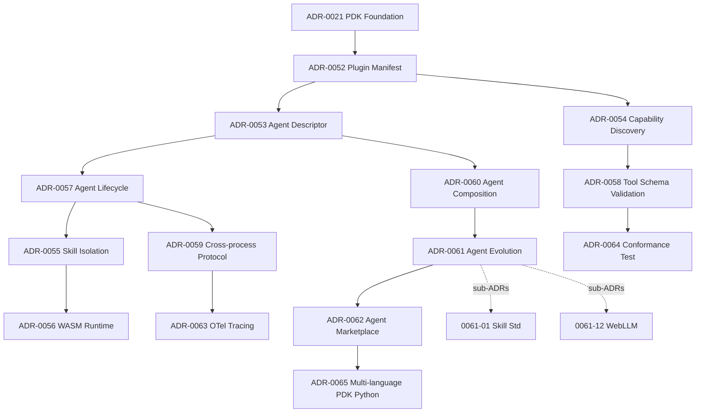

# Design — ADR Batch Agent-as-Plugin Architecture

**关联**: `proposal.md`, `tasks.md`

## ADR 关系图 (Mermaid)

## ADR 分层

### L0 Foundation (已 ship)
- ADR-0021 PDK 基础架构 (vendored in monorepo, Dual-Repo policy)

### L1 Manifest & Discovery (shipped 设计, 部分实施)
- **ADR-0052** Plugin Manifest (6 份 pdk_manifest.json 已 ship)
- **ADR-0054** Capability Discovery (capabilities 字段已 ship)
- **ADR-0058** Tool Schema Validation (input_schema/output_schema 已 ship)

### L2 Agent Core (设计已 ship, 实施 Sprint 25+)
- **ADR-0053** Agent Descriptor Interface
- **ADR-0057** Agent Lifecycle
- **ADR-0060** Agent Composition

### L3 Isolation & Runtime (Sprint 26-27)
- **ADR-0055** Skill Isolation
- **ADR-0056** WASM Runtime

### L4 Cross-cutting (Sprint 26-28)
- **ADR-0059** Cross-process Protocol
- **ADR-0063** OTel Tracing
- **ADR-0064** PDK Conformance Test Suite

### L5 Evolution & Ecosystem (Sprint 29+)
- **ADR-0061** Agent Evolution (12 子 ADR)
- **ADR-0062** Agent Marketplace
- **ADR-0065** Multi-language PDK Python

## 与已 ship 代码的对应关系

| 已 ship 代码 | 对应 ADR | 备注 |
|-------------|---------|------|
| `pdk/*/pdk_manifest.json` (6 份) | ADR-0052 | schema 完整实施 |
| `pdk/*/pdk_entry.cpp` 的 `register_tool_function` 调用 | ADR-0054 | capability 注册已 ship |
| `pdk/fs_tools/` 路径检查 | ADR-0055 v1 (workdir 边界) | 完整隔离 Sprint 26 |
| `pdk/shell_tools/` 危险命令黑名单 | ADR-0055 v1 (基础沙箱) | 完整隔离 Sprint 26 |
| `examples/pdk_chat_demo/` 端到端 demo | ADR-0052/0054/0057/0060 (lifecycle/composition) | v1 实现, v2 待 Sprint 25 |
| `lib/loop/react.agent.md` | ADR-0057 (React lifecycle) | react 子集, plan_execute/fork_join 待 |
| `skills/code-review/` | ADR-0061 (skill 模板) | 12 子 ADR 治理骨架 |

## 不在本 change 范围

- 任何 ADR 的实施代码 (所有 ADRs 内容已 ship 在 `docs/adr/`)
- 任何已 ship 代码的修改 (本次仅补充 OpenSpec governance 链接)
- 任何 capability/spec 的修改 (本次仅补 OpenSpec change 跟踪)